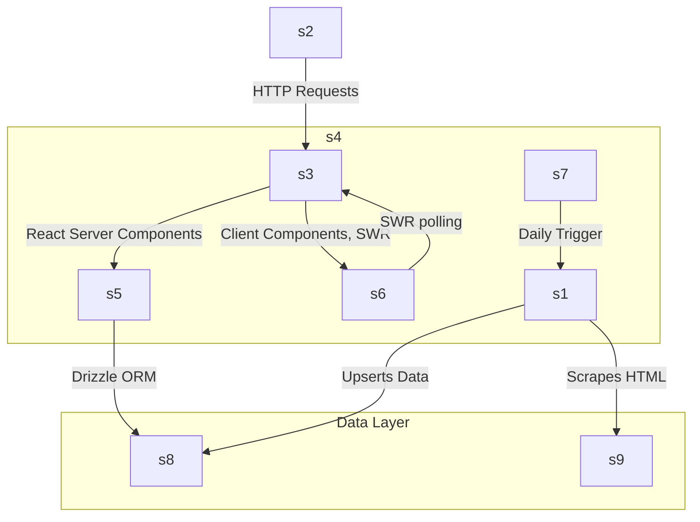
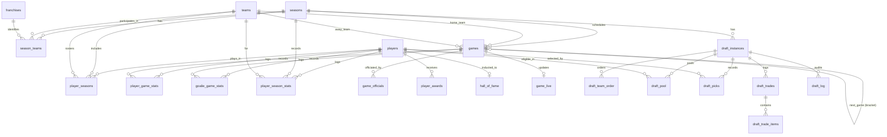

# Technical Architecture Document

## Overview

The BASH Hockey repository is a full-stack Next.js application designed to display real-time scores, standings, player statistics, and game details for the Bay Area Street Hockey (BASH) league. It utilizes a modern React ecosystem combined with a serverless Postgres database to store and serve data synced from an external source (Sportability).

## Tech Stack

- **Framework**: Next.js 16 (App Router) with React 19
- **Database**: Neon Postgres via **Drizzle ORM** (`drizzle-orm/neon-http`)
- **Styling & UI**: Tailwind CSS v4, shadcn/ui (Radix UI primitives), `lucide-react` for icons
- **Client Data Fetching**: SWR hooks for client-side caching and revalidation
- **Deployment**: Vercel

> **⚠️ Neon HTTP Driver Constraint:** The project uses the **stateless HTTP** driver (`@neondatabase/serverless` → `neon-http`), which **does not support `db.transaction()`**. All multi-step writes must use sequential `await db.*` calls. This is safe for admin operations on draft data but should be noted when writing new routes that modify multiple tables.

## Key Data Structures (Database Schema)

Here is a high-level entity-relationship (ER) diagram of the database:

The Drizzle schema (`lib/db/schema.ts`) defines the following table groups:

1. **League Structure**
   - `seasons`: Defines seasons (e.g., "Fall 2025") and links to Sportability league IDs. Stores configuration like `status` (draft/active/completed), `season_type` (fall/summer), and `playoff_teams`.
   - `teams`: Global team identities.
   - `season_teams`: Junction table linking teams to specific seasons, with an optional `franchise_slug` FK.
   - `franchises`: Persistent franchise identities across seasons (e.g., "Red", "Blue"). Each franchise has a `color` used for draft board theming.

2. **Games & Scheduling**
   - `games`: Stores game details, dates, times, home/away teams, scores, and status (`upcoming` vs `final`). Flags for overtime, shootout, and forfeit. Includes schedule management columns:
     - `game_type`: Categorizes games as `regular`, `playoff`, `tryout`, `practice`, `exhibition`, `championship`, or `jamboree`. The legacy `is_playoff` boolean is kept for stats queries.
     - `home_placeholder` / `away_placeholder`: Display labels for unresolved teams (e.g., "Seed 1", "Winner SF-A"). When set, `home_team`/`away_team` reference a sentinel `"tbd"` slug.
     - `bracket_round`: Playoff round identifier (`play-in`, `quarterfinal`, `semifinal`, `final`).
     - `series_id` / `series_game_number`: Groups games into matchup series (e.g., `sf-a` game 1 of 3).
     - `next_game_id` / `next_game_slot`: Self-referential FK linking bracket games for auto-advancement.
   - `game_live`: Stores real-time scorekeeping state for live updates.
   - `game_officials`: Records referees and linesmen for each game.

3. **Players & Statistics**
   - `players`: Global player identities.
   - `player_seasons`: Links players to seasons and teams, tracking if they are a goalie, captain (`is_captain`), or rookie (`is_rookie`).
   - `player_game_stats`: Granular per-game stats for skaters (goals, assists, points, PIM, etc.).
   - `goalie_game_stats`: Granular per-game stats for goalies (shots against, saves, shutouts).
   - `player_season_stats`: Aggregated historical stats for seasons prior to detailed per-game data availability.

4. **Awards & History**
   - `player_awards`: Auto-computed and historical player awards.
   - `hall_of_fame`: Hall of Fame inductees and achievements.

5. **Metadata**
   - `sync_metadata`: Tracks the last time the database was synced with Sportability.

6. **Draft System**
   - `draft_instances`: Draft configuration and live state (status, timer, current pick position). Status lifecycle: `draft` → `published` → `live` → `completed` → `archived`.
   - `draft_team_order`: Maps teams to draft order positions within a draft instance.
   - `draft_pool`: Eligible players for a draft, with keeper assignments and Sportability registration metadata (JSONB).
   - `draft_picks`: Pre-generated pick slots. When a draft goes `live`, all slots are created with `playerId = null`. Keeper picks are filled immediately; remaining picks are filled as the draft progresses.
   - `draft_trades`: Trade records (pre-draft pick swaps and live trades) between teams.
   - `draft_trade_items`: Individual items exchanged in a trade (picks, identified by round/position or pickId).
   - `draft_log`: Audit trail of all draft actions (picks, trades, undos, keepers).

7. **Registration System**
   - `users` / `accounts` / `sessions` / `verification_tokens`: NextAuth.js authentication tables.
   - `registration_periods`: Configurable registration windows per season with pricing, capacity limits, and open/close dates.
   - `registration_questions`: Custom questions attached to registration periods.
   - `legal_notices`: Waivers and legal documents requiring acknowledgement.
   - `registration_period_notices`: Junction linking notices to registration periods.
   - `registrations`: Player registration submissions with status tracking, payment info, and linked player IDs.
   - `registration_answers`: Responses to custom registration questions.
   - `notice_acknowledgements`: Records of waiver/notice acceptance.
   - `discount_codes` / `registration_period_discounts`: Promo codes and per-period discount configuration.
   - `extras` / `registration_period_extras` / `registration_extras`: Optional add-ons (jerseys, etc.) purchasable during registration.

## Key Functions and Data Flow

### 1. Data Sync (`app/api/bash/sync/route.ts`)
Game data is primarily sourced from Sportability. A daily cron job (configured in `vercel.json`) calls the `/api/bash/sync` POST endpoint. This script scrapes Sportability HTML pages and upserts the latest schedule, scores, and boxscores into the Postgres database. The sync process intelligently skips any games that are being actively managed by the Live Scorekeeper to prevent overwriting manually entered live data.

### 1a. Roster Import (`/api/bash/admin/seasons/[id]/roster/import-preview` + `import`)
Admins import player rosters via **CSV** files exported from Sportability. The two-step flow:
1. **Preview** (`import-preview`): Parses the CSV using a built-in RFC 4180 parser (no external dependencies), maps `FirstName`/`LastName`/`Team`/`ExpPos`/`Rookie` columns, validates team slugs, and returns stats (new vs existing players).
2. **Import** (`import`): Upserts players into the global `players` table, then inserts `player_seasons` entries. Supports **Overwrite** (wipes season roster first) and **Append** (skips already-assigned players) modes.

> **Note:** Sportability exports `.xlsx` files. Admins must convert to `.csv` before uploading (Excel → Save As CSV, or Google Sheets → Download as CSV). This avoids a heavy `xlsx` dependency that is incompatible with the Next.js server bundler.

### 2. Server-Side Data Fetching (`lib/fetch-*.ts`)
The application heavily uses Next.js async Server Components. When a page loads, it fetches data using functions located in `lib/fetch-*.ts`, which execute Drizzle ORM queries against Neon Postgres. 

- **`fetchBashData(season)`**: Found in `lib/fetch-bash-data.ts`, this is a crucial function that fetches all games for a season and dynamically computes the **Standings** in-memory based on wins (3 pts), OT wins (2 pts), OT losses (1 pt), and losses (0 pts).
- **`fetchPlayerDetail(slug)`** / **`fetchTeamDetail(slug)`**: Functions that aggregate stats for specific entities using complex SQL joins.

### 3. Client-Side Hydration & Live Updates (`lib/hockey-data.ts`)
While initial page loads are server-rendered, the application uses SWR hooks (e.g., `useBashData`) to maintain fresh data. The server passes `fallbackData` to the client, and SWR periodically polls the API (every 60-120s) to refresh the UI without full page reloads, ensuring live scores are updated seamlessly.

### 4. Schedule Generation (`lib/schedule-utils.ts`)
Pure utility functions (no side effects, no DB calls) used by the admin wizards:
- **`generateRoundRobin()`**: Berger tables algorithm for fair round-robin pairings with configurable games-per-week and multi-cycle support.
- **`mapRoundRobinToGames()`**: Maps generic slot pairings to real teams and dates.
- **`generateBracket()`**: Builds a linked playoff bracket for 4–8 teams using standard seeding (#1v#8, #4v#5, #2v#7, #3v#6) with byes and auto play-in for odd counts. Supports per-round series lengths (best-of-1 or best-of-3).
- **`checkSeriesClinch()`**: Determines if a best-of-N series has been decided.

> **Topological Generation Constraints**: When playoff brackets are generated, child nodes (like Finals) are topologically sorted and inserted before parent nodes (like Semi-finals) to ensure correct `nextGameId` reference ordering. Note: `nextGameId` is a **soft reference** (application-enforced, not a DB-level FK) to simplify game deletion workflows. Dynamic `gen-[UUID]` IDs prevent cross-season primary-key collisions, and a sentinel `"tbd"` team slug is automatically upserted to safely support Placeholder Mode before real team seedings are resolved.

### 5. Draft System (`app/api/bash/admin/seasons/[id]/draft/`)
The draft system manages the entire lifecycle of a league draft:

1. **Creation**: Admin creates a draft instance via a 5-step wizard (settings → player pool → teams & captains → draft order & pre-draft trades → review). Player pools can be imported from Sportability CSV exports using the shared `lib/csv-utils.ts` parser.
2. **Pre-Draft Trades**: Pick swaps can be arranged before the draft starts. The `lib/draft-trade-resolver.ts` engine resolves chain trades (e.g., A→B→C pick ownership) when picks are generated.
3. **Live Draft**: Transitioning to `live` pre-generates all pick slots (`lib/draft-helpers.ts` handles snake/linear ordering). Keeper picks are auto-filled. The admin enters picks through a real-time board with player search, timer controls, and undo support.
4. **Public Board**: `/draft/[season]` polls the public API (`/api/bash/draft/[season]`) every 3 seconds via SWR. Features include pick animations, NHL draft chime audio, position filtering, and a player card modal with career stats.
5. **Post-Draft**: CSV export, JSON backup/restore, and roster push (upserts drafted players into `player_seasons` for the season).

> **Security**: All 22 admin draft API routes enforce `getSession()` authentication. Public routes only expose drafts in `published`/`live`/`completed` status.

### 6. Routing Structure
The App Router maps URLs directly to server components:
- `/` -> Home page (Scoreboard)
- `/standings`, `/stats` -> Leaderboards and league tables
- `/player/[slug]`, `/team/[slug]`, `/game/[id]` -> Detail views
- `/register` -> Player registration flow (temporary — will be removed)
- `/draft/[season]` -> Public draft board (e.g., `/draft/2026-summer`)
- `/scorekeeper` -> Game selection for live scoring
- `/scorekeeper/[id]` -> Live game scorekeeper
- `/admin/seasons/[id]` -> Season management (Schedule, Standings, Teams, Draft tabs)
- `/admin/seasons/[id]/draft/[draftId]/board` -> Admin live draft board
- `/admin/registration` -> Registration period management (questions, discounts, notices, extras)
- `/admin/franchises` -> Franchise manager
