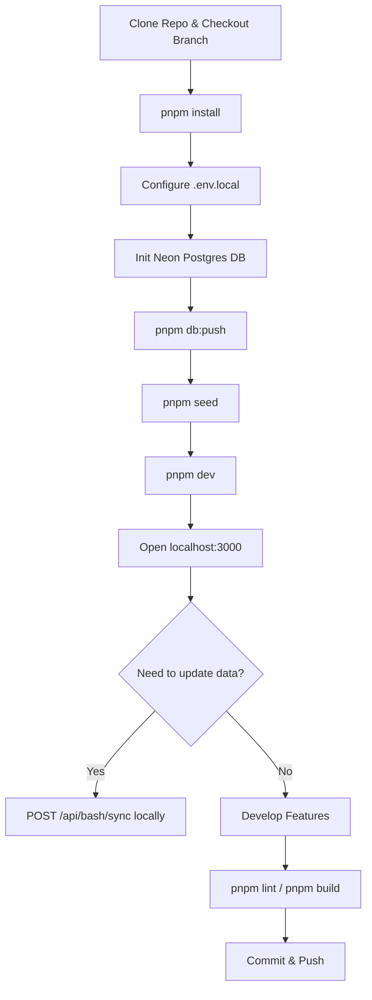

# Developer Workflow Document

## Prerequisites

Before starting development on the BASH Hockey website, assure you have the following installed on your local machine:
- **Node.js** (Version 18 or higher)
- **pnpm** (Package manager, install via `npm install -g pnpm`)
- A **Neon Postgres** database instance (or any compatible PostgreSQL database).

## Local Environment Setup



Follow these steps to get the site running locally:

### 1. Clone the Repository & Install Dependencies
```bash
# Clone the repository
git clone https://github.com/rhotter/bash.git
cd bash

# Switch to your development branch
git checkout your-branch-name

# Install frontend dependencies
pnpm install
```

### 2. Configure Environment Variables
Create a `.env.local` file at the root of the project to store your local secrets. It must contain your Postgres connection string:
```bash
DATABASE_URL=postgresql://<user>:<password>@<host>/<database>?sslmode=require
```

### 3. Setup the Database Schema
You need to initialize your local or cloud database with the correct tables.
Push the Drizzle Schema directly to your database by running:
```bash
pnpm db:push
```

### 4. Seed the Database
To populate the database with real team and game data from the Sportability API:
```bash
pnpm seed
```
*(Note: Ensure your `DATABASE_URL` is set before running this command).*

### 5. Start the Development Server
```bash
pnpm dev
```
Navigate to `http://localhost:3000` in your browser. The app should now be running locally.

## Common Development Tasks

- **Linting**: To ensure code quality and prevent common errors, run:
  ```bash
  pnpm lint
  ```

- **Building for Production**: To verify that the build succeeds before pushing to main:
  ```bash
  pnpm build
  ```

- **Running Scripts requiring DB access**: 
  If you write custom one-off scripts in the `scripts/` directory that need to talk to the DB, run them like this:
  ```bash
  export $(cat .env.local | grep -v '^#' | xargs) && npx tsx scripts/your-script.ts
  ```

## Testing Live Scorekeeper

The BASH Scorekeeper feature (`/scorekeeper`) allows scorekeepers to manually update game clocks, scores, and events live.
To access and test the live scorekeeper logic locally:
1. Ensure your local server is running (`pnpm dev`).
2. Obtain or generate the scorekeeper PIN (stored as `SCOREKEEPER_PIN` in your environment variables). If you are testing offline sync features, you can turn off your web connection while recording events and test the synchronization once you come back online.
3. Proceed to `http://localhost:3000/scorekeeper` and insert the PIN to manage active games.

## Data Sync Workflow
The production site automatically syncs data via a daily Vercel cron job calling `/api/bash/sync`. If you need to force a sync locally to get the absolute latest scores/games:
1. Ensure your local server is running (`pnpm dev`).
2. Send a POST request to the local sync endpoint (e.g., using `curl` or Postman):
   ```bash
   curl -X POST http://localhost:3000/api/bash/sync
   ```
*(Note: The sync process scrapes Sportability and can take a minute to complete.)*
