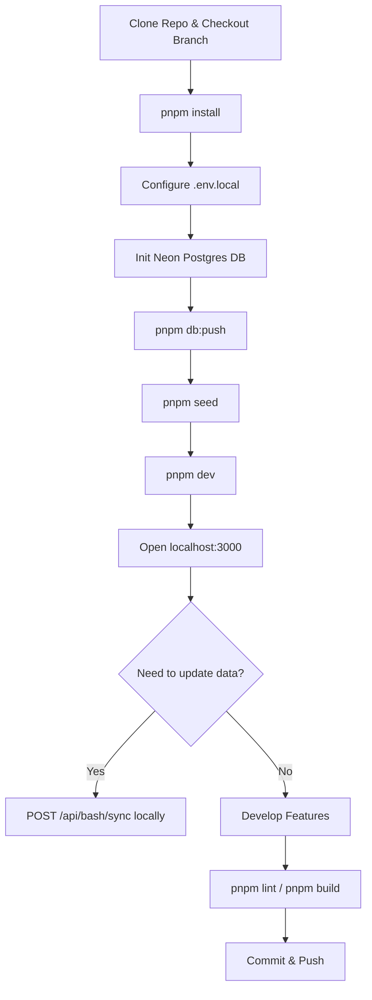

# Developer Workflow Document

## Prerequisites

Before starting development on the BASH Hockey website, assure you have the following installed on your local machine:
- **Node.js** (Version 18 or higher)
- **pnpm** (Package manager, install via `npm install -g pnpm`)
- A **Neon Postgres** database instance (or any compatible PostgreSQL database).

## Local Environment Setup


```mermaid
graph TD
    A[Clone Repo & Checkout Branch] --> C[pnpm install]
    C --> D[Configure .env.local]
    D --> E[Init Neon Postgres DB]
    E --> F[pnpm db:push]
    F --> G[pnpm seed]
    G --> H[pnpm dev]
    H --> I[Open localhost:3000]
    
    I --> J{Need to update data?}
    J -- Yes --> K[POST /api/bash/sync locally]
    J -- No --> L[Develop Features]
    
    L --> M[pnpm lint / pnpm build]
    M --> N[Commit & Push]
```

Follow these steps to get the site running locally:

### 1. Clone the Repository & Install Dependencies
```bash
# Clone the repository
git clone https://github.com/rhotter/bash.git
cd bash

# Switch to your development branch
git checkout your-branch-name

# Install frontend dependencies
pnpm install
```

### 2. Configure Environment Variables
Create a `.env.local` file at the root of the project to store your local secrets. It must contain your Postgres connection string:
```bash
DATABASE_URL=postgresql://<user>:<password>@<host>/<database>?sslmode=require
```

### 3. Setup the Database Schema
You need to initialize your local or cloud database with the correct tables.
Push the Drizzle Schema directly to your database by running:
```bash
pnpm db:push
```

> **Note:** If you pull changes that include new schema columns (e.g., additive schedule management fields), re-run `pnpm db:push` to apply them. Drizzle will only add new columns — it won't drop or modify existing data.

### 4. Seed the Database
To populate the database with real team and game data from the Sportability API:
```bash
pnpm seed
```
*(Note: Ensure your `DATABASE_URL` is set before running this command).*

### 4b. Syncing Live Production Data to Dev (Recommended)
`pnpm seed` imports historical data from Sportability up to the 2025–2026 season. Native BASH seasons (such as Summer 2026 and 2026–2027 pre-season drafts) were managed directly in BASH and exist only in the production database.

To replicate recent seasons, game boxscores, rosters, and live draft boards from production into your development or branch database:

```bash
# Using Environment Variables (requires both PROD_URL and DEV_URL)
PROD_URL='<prod-db-url>' DEV_URL='<dev-db-url>' npx tsx scripts/export-prod-db.ts

# Or using CLI Flags
npx tsx scripts/export-prod-db.ts --from '<prod-db-url>' --to '<dev-db-url>'

# Optional: Sync specific seasons only
npx tsx scripts/export-prod-db.ts --from '<prod-db-url>' --to '<dev-db-url>' --seasons 2026-summer,bash-2026-2027
```

> **Safety & Credential Security:**
> - **Never** save `PROD_URL` into `.env.local` or commit it to Git. Pass it at runtime via command line or environment variables.
> - The script automatically masks passwords in terminal output.
> - Source and target URLs cannot be identical (the script will abort to prevent accidental overwrites).
> - Dynamic name-to-ID alignment ensures that target historical stats are preserved without ID collision.

### 5. Start the Development Server
```bash
pnpm dev
```
Navigate to `http://localhost:3000` in your browser. The app should now be running locally.

## Common Development Tasks

- **Linting**: To ensure code quality and prevent common errors, run:
  ```bash
  pnpm lint
  ```

- **Type Checking**: To verify full type safety across the project (catches errors not caught by lint):
  ```bash
  npx tsc --noEmit
  ```
  > **Note:** There are a small number of pre-existing type errors in legacy files. When adding new code, ensure your changes introduce zero new errors.

- **Building for Production**: To verify that the build succeeds before pushing to main:
  ```bash
  pnpm build
  ```

- **Full Quality Gate**: Run all three checks before pushing:
  ```bash
  pnpm lint && npx tsc --noEmit && pnpm build
  ```

- **Running Banner Tests**: To verify the full banner test suite (helper math, date/timezone parsing, SWR, admin & public APIs, responsive layout assertions, draft sync lifecycle):
  ```bash
  npx vitest run tests/banners
  ```

- **Running Scripts requiring DB access**: 
  If you write custom one-off scripts in the `scripts/` directory that need to talk to the DB, run them like this:
  ```bash
  export $(cat .env.local | grep -v '^#' | xargs) && npx tsx scripts/your-script.ts
  ```

## Testing Live Scorekeeper

The BASH Scorekeeper feature (`/scorekeeper`) allows scorekeepers to manually update game clocks, scores, and events live.
To access and test the live scorekeeper logic locally:
1. Ensure your local server is running (`pnpm dev`).
2. Obtain or generate the scorekeeper PIN (stored as `SCOREKEEPER_PIN` in your environment variables). If you are testing offline sync features, you can turn off your web connection while recording events and test the synchronization once you come back online.
3. Proceed to `http://localhost:3000/scorekeeper` and insert the PIN to manage active games.

## Data Sync Workflow
There are two distinct data sync mechanisms in BASH:

1. **Daily Sportability Sync (`/api/bash/sync`)**:
   - The production site automatically runs a daily Vercel cron job calling `/api/bash/sync` to scrape scores and schedules from Sportability for traditional fall seasons.
   - To trigger locally:
     ```bash
     curl -X POST http://localhost:3000/api/bash/sync
     ```

2. **Database Replication from Production (`scripts/export-prod-db.ts`)**:
   - In-house seasons (e.g., Summer 2026, 2026–2027 draft instances, live scorekeeper games) are created directly within BASH and do not exist on Sportability.
   - Use `scripts/export-prod-db.ts` to replicate these records from production into your target dev database:
     ```bash
     PROD_URL='<prod-db-url>' DEV_URL='<dev-db-url>' npx tsx scripts/export-prod-db.ts
     ```

## Testing the Admin Dashboard

The admin dashboard (`/admin`) provides season management, schedule generation, and player/team administration.

1. Ensure your local server is running (`pnpm dev`).
2. Navigate to `http://localhost:3000/admin`. Authentication uses a session cookie — you'll need valid admin credentials.
3. Key admin features to test:
   - **Schedule Tab** (`/admin/seasons/[id]` → Schedule tab): View, add, edit, and delete games. Launch the **Round-Robin Wizard** or **Playoff Bracket Wizard** to generate schedules.
   - **Round-Robin Wizard**: Generates a full season schedule using the Berger tables algorithm. Supports configurable games-per-week, skip weeks, and per-slot times/locations.
   - **Playoff Bracket Wizard**: Generates a linked bracket for 4–8 teams with standard seeding, configurable series lengths (best-of-1 or best-of-3), and auto play-in for odd team counts.
   - **Roster Import**: Upload a CSV player file (exported from Sportability, saved as `.csv`) via the Sportability Import button on the Roster tab. The two-step preview → confirm flow supports Overwrite and Append modes.
   - **Franchise Manager** (`/admin/franchises`): Create and manage franchise identities (name, color) that persist across seasons. Franchises are linked to season teams for draft board theming.
   - **Draft Tab** (`/admin/seasons/[id]` → Draft tab): Create, configure, and manage draft instances. The 5-step wizard walks through settings, player pool (with Sportability CSV import), teams & captains, draft order & pre-draft trades, and review.
   - **Live Draft Board** (`/admin/seasons/[id]/draft/[draftId]/board`): Enter picks, manage timer, execute trades, and undo picks. This is the commissioner's control center during a live draft.
   - **Public Draft Board** (`/draft/[season]`): The read-only spectator view. Polls the server every 3 seconds for live updates. Test by opening this URL in a separate browser while making picks on the admin board.
   - **Banner Management** (`/admin/banners`): Create, edit, toggle active status, and delete announcement banners. Test the **Dual Interactive Preview** (Desktop full-width vs Mobile 375px), length guidance warnings (>35 chars on mobile), countdown configurations (deadline vs event), route suppression (`hideOnPaths`), and dismissal resets. Also test the automated draft lifecycle banner hooks: publishing a draft creates a pre-draft countdown banner, starting a draft activates a live alert banner, completing a draft creates a results banner expiring at upcoming Friday midnight PT, and archiving deactivates it.
4. Generated schedules call the API routes under `/api/bash/admin/seasons/[id]/schedule/`. The wizards run generation logic entirely client-side (`lib/schedule-utils.ts`) and only POST the final payload to the server.
5. Draft API routes live under `/api/bash/admin/seasons/[id]/draft/`. All 22 endpoints require admin authentication via `getSession()`.

## Known Gotchas

### No `db.transaction()` Support
The project uses Neon's **HTTP driver** (`drizzle-orm/neon-http`), which is stateless and **does not support transactions**. Any route that wraps writes in `db.transaction()` will throw:

```
No transactions support in neon-http driver
```

**Workaround**: Use sequential `await db.*` calls instead. This is acceptable for admin operations on draft data. If true ACID transactions are ever needed, the project would need to switch to the `neon-serverless` WebSocket driver.

### Roster Import Requires CSV (Not XLSX)
Sportability exports player lists as `.xlsx`. The import route uses a **built-in CSV parser** instead of the `xlsx` npm package, because `xlsx` depends on Node.js native APIs (`Buffer`, `fs`) that break under Next.js webpack bundling. Admins must convert the file to CSV before uploading.

