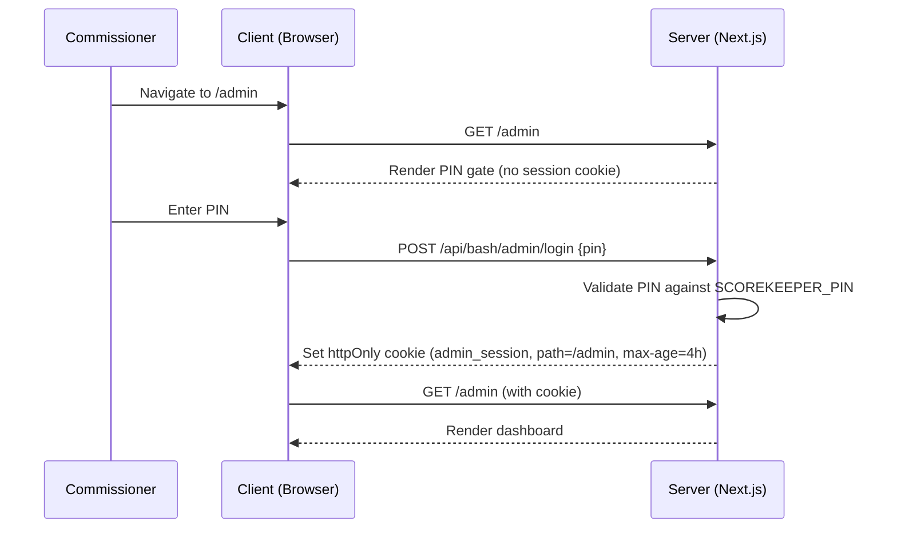

# PRD: Admin Phase 1 — Dashboard & Season Management

> **Status**: Draft
> **Author**: Chris Torres
> **Created**: 2026-04-18
> **Parent PRD**: [prd-admin-page.md](./prd-admin-page.md)

## 1. Overview

Phase 1 delivers the admin dashboard shell and season management features. This is the foundation that all future admin phases build on — auth, layout, navigation, and the highest-priority feature: managing season lifecycle from creation through completion.

### What's in scope
- Admin layout with PIN gate and session persistence
- Dashboard home with at-a-glance stats
- Full season CRUD with status lifecycle (draft → active → completed)
- Season creation wizard
- Placeholder panels for draft, registration, and schedule wizards
- Manual sync controls

### What's NOT in scope (deferred to Phase 2+)
- Player management / duplicate merging
- Team management
- Awards & Hall of Fame management
- Data quality dashboard

---

## 2. Architecture

### 2.1 Layout

Nested layout under `app/admin/` (Option B from parent PRD). The admin shell has its own sidebar navigation and does not use the public `SiteHeader`.

```
app/admin/
  layout.tsx              ← PIN gate + admin shell (sidebar, topbar)
  page.tsx                ← dashboard home
  seasons/
    page.tsx              ← season list
    [id]/
      page.tsx            ← season detail / edit
    new/
      page.tsx            ← season creation wizard
```

### 2.2 Auth Flow



**Session cookie spec**:
| Property | Value |
|---|---|
| Name | `admin_session` |
| Value | HMAC-signed token containing `{ authenticated: true, iat: timestamp }` |
| `httpOnly` | `true` |
| `secure` | `true` (production only) |
| `sameSite` | `lax` |
| `path` | `/admin` |
| `maxAge` | `14400` (4 hours) |

**New API routes**:
- `POST /api/bash/admin/login` — validates PIN, sets session cookie
- `POST /api/bash/admin/logout` — clears session cookie

**Server-side validation**: The `app/admin/layout.tsx` reads the cookie and validates the HMAC signature. If invalid or expired, it renders the PIN gate instead of `children`.

### 2.3 Database Changes

The `seasons` table needs a new `status` column:

```sql
ALTER TABLE seasons
  ADD COLUMN status text NOT NULL DEFAULT 'active',
  ADD COLUMN standings_method text NOT NULL DEFAULT 'pts-pbla',
  ADD COLUMN game_length integer NOT NULL DEFAULT 60,
  ADD COLUMN default_location text,
  ADD COLUMN admin_notes text;
```

**Drizzle schema update** (`lib/db/schema.ts`):
```typescript
export const seasons = pgTable("seasons", {
  id: text("id").primaryKey(),
  name: text("name").notNull(),
  leagueId: text("league_id"),  // optional — only needed when connecting to Sportability for sync
  isCurrent: boolean("is_current").notNull().default(false),
  seasonType: text("season_type").notNull().default("fall"),
  status: text("status").notNull().default("active"),       // draft | active | completed
  standingsMethod: text("standings_method").notNull().default("pts-pbla"), // see §3.7
  gameLength: integer("game_length").notNull().default(60),  // in minutes
  defaultLocation: text("default_location"),                 // e.g. "James Lick Arena"
  adminNotes: text("admin_notes"),                           // private commissioner notes
  playoffTeams: integer("playoff_teams"),                    // Number of teams that make playoffs (nullable for historical seasons)
})
```

**Status values**:
| Status | Description | Public visibility |
|---|---|---|
| `draft` | Season is being set up — not yet visible to public | ❌ Hidden |
| `active` | Season is live — games being played | ✅ Visible |
| `completed` | Season is over — archived, read-only | ✅ Visible |

**Migration strategy**: All existing seasons get `status = 'completed'` except the current season which gets `status = 'active'`. This can be done via a Drizzle migration or a one-time script.

### 2.4 Phase 2 Data Migration: Single Source of Truth

Currently, historical seasons are **hardcoded** in `lib/seasons.ts` as a static `SEASONS` array, which acts as the source of truth for the public site.

For Phase 1, the admin will manage new seasons entirely in the **database** (`seasons` table), and the database will serve as the source of truth for new operations.

In Phase 2, we will fully migrate all historical data to the database to ensure a **single source of truth**, eliminating the need for `lib/seasons.ts`.

When Phase 2 is implemented, it will:
1. **Seed the Database**: A one-time script will loop through the `SEASONS` array in `lib/seasons.ts` and `INSERT` all 30+ historical seasons into the database. They will all be marked with `status = 'completed'` and historical flags (`statsOnly`).
2. **Refactor the Frontend**: Update getters like `getSeasonById()`, `getAllSeasons()`, and `getCurrentSeason()` (and API like `app/api/bash/seasons/route.ts`) to exclusively query the database using Drizzle (`db.select().from(schema.seasons)`).
3. **Deprecate File**: Completely remove the hardcoded `lib/seasons.ts`.

> [!IMPORTANT]
> Migrating entirely to the DB removes the complexity of managing a split-brain architecture (database vs. static file). Once completed, the Admin Dashboard can manage 100% of BASH data without requiring codebase deployments.

---

## 3. Features

### 3.1 Admin Shell

**Sidebar navigation** (visible on all `/admin/*` pages):
- 🏠 Dashboard (`/admin`)
- 📅 Seasons (`/admin/seasons`)
- 🔄 Sync (action button, no page)
- 🔓 Logout (action button)

**Topbar**:
- Orange/amber admin indicator bar at top (matches existing admin mode UX)
- "BASH Admin Dashboard" branding with logo
- Quick links: "View Public Site", "Logout"
- Below: sidebar trigger + "Commissioner Tools" label

**Design**: Desktop-first. Sidebar collapses to a hamburger on mobile. Uses the **same light theme as the public site** for visual consistency, with a prominent **orange admin bar** across the top to clearly indicate commissioner mode. All UI components use standard design tokens (`--background`, `--foreground`, `--primary`, etc.) — no custom dark theme overrides.

### 3.2 Dashboard Home (`/admin`)

The dashboard provides a quick overview of active/draft seasons and key actions.

#### Active Seasons Table (primary content)

Compact summary table showing only **active and draft** seasons (mirrors Sportability's "Open Leagues" pattern). Completed/archived seasons are accessible via a "View Archived" link.

| Column | Source | Example |
|---|---|---|
| Season | `seasons.name` | BASH 2025-2026 |
| Status | `seasons.status` | 🟢 Active |
| Tms | COUNT from `season_teams` | 7 |
| Gms | COUNT from `games` | 72 |
| Plyrs | COUNT from `player_seasons` | 131 |
| Progress | Completed / Total games | 47 / 72 |
| Actions | Summ \| Edit \| View | links |

Each row links to the season detail page.

#### Sidebar quick actions
- "Sync Now" button with last sync timestamp
- "New Season" button → `/admin/seasons/new`

> [!NOTE]
> An **Action Items / Alert Panel** (overdue games, missing boxscores, stale sync, etc.) is planned for Phase 3. See [prd-admin-page.md §4.8](./prd-admin-page.md).

### 3.3 Season List (`/admin/seasons`)

**Table columns**:
| Column | Source |
|---|---|
| Name | `seasons.name` |
| Type | `seasons.season_type` (fall / summer) |
| Status | `seasons.status` (draft / active / completed) — color-coded badge |
| Teams | COUNT from `season_teams` |
| Games | COUNT from `games` |
| Players | COUNT from `player_seasons` |
| Actions | Edit, View on site (if not draft) |

**Filtering**: By status (draft / active / completed / all), by type (fall / summer)

**Sort**: Newest first (by season ID, which follows a chronological pattern)

### 3.4 Season Detail / Edit (`/admin/seasons/[id]`)

**Editable fields**:
- Season name
- Season type (fall / summer)
- Status (draft → active → completed) — one-way progression with a native `AlertDialog` confirmation to prevent accidental clicks.
  - Transitioning draft → active **automatically sets `is_current = true`** on this season. Does NOT modify the previous season's `is_current` flag (multiple seasons can have `is_current = true` during a transition, but `getCurrentSeason()` should resolve to the newest active one).
- League ID (Sportability reference) — optional, can be added later when ready to sync

**Season Settings** (collapsible section on the detail page):
- **Standings method** — dropdown with options from §3.7. Default: `Pts-PBLA` (BASH's current method: W=3, OTW=2, OTL=1, L=0). Determines how standings are calculated and displayed on the public site.
- **Game length** — number input in minutes. Default: `60`. Used for scheduling and period calculations.
- **Default location** — text input. Auto-populated based on season type (fall → "James Lick Arena", summer → "Dolores Park Multi-purpose Court"). Can be overridden.
- **Playoff teams** — number input. Sets the count of playoff teams, editable only while in `draft` status.
- **Admin notes** — textarea. Private commissioner-only notes, not visible on the public site. Useful for tracking decisions, rule changes, or season-specific context (e.g. "Self Request; Added 8/24/2025").

**Tabbed sections on the season detail page**:

#### Overview tab (season-level dashboard)

The overview acts as a mini-dashboard for this specific season, with inline previews that link to their respective tabs. Inspired by Sportability's "League Summary" page but better organized.

**Key Analytics bar** (top):
- Compact row of clickable stat badges: `7 Teams` | `131 Players` | `72 Games` | `47 Completed`
- Each badge links to its respective tab (Teams, Roster, Schedule)

**"View Public Site →"** button:
- Prominent link to the public site's view of this season (e.g. `/?season=2025-2026`)
- Only shown for active/completed seasons (not draft)

**Upcoming Schedule preview** (inline, 5 games max):
- Shows next 5 upcoming games with date, time, teams, location
- "View Full Schedule →" links to the Schedule tab
- For completed seasons: shows "Season complete" with final standings link

**Settings summary** (read-only card):
- Displays current standings method, game length, default location, league ID as a compact key-value list
- "Edit Settings" button opens the settings form (§3.4 editable fields + season settings)

**Registration status** (banner):
- For draft seasons: "Registration not started" or placeholder date
- For active seasons: "Registration closed [date]"
- For completed seasons: "Registration closed [date]" (read-only)

**Admin notes** (expandable):
- Shows the first line of admin notes, expandable to full text
- Quick "Edit" link to modify

#### Teams tab
- List of teams assigned to this season (from `season_teams`)
- Add/remove teams for draft seasons only (locked otherwise).
- Global Franchise Directory filters out placeholder teams (`tbd`, `seed-*`).
- **Create Team**: Inline button opens a dialog to quickly create a new team (Name and auto-generated Team ID). It calls `POST /api/bash/admin/teams` and instantly assigns it to the season. New teams use a generic hockey stick SVG fallback if no image logo is mapped.

#### Roster tab
- Player assignments for this season (from `player_seasons`)
- Contextual Goalie Coverage Alert: Displays an amber warning banner if the number of primary goalies assigned is fewer than the number of teams.
- Read-only for active/completed seasons

#### Schedule tab
- For active seasons: editable view of the current season schedule with the ability to make changes to scheduled games
- For completed seasons: read-only link to the public schedule page
- For draft seasons: placeholder card with description of upcoming schedule wizard:
  > **Schedule Wizard** (coming soon)
  > Define the full season schedule including regular season matchups and playoff dates. Configure time slots, bye weeks, and rivalry matchups.

#### Draft tab
- **For draft seasons**: Links to the Draft Creation Wizard or Draft Management Dashboard (`/admin/seasons/[id]/draft`). Provides full setup tools for configuring the player pool, draft order, trades, and keepers.
- **For active/completed seasons**: Read-only link to the final draft results or public draft board (`/draft/[season]`).

#### Registration tab (placeholder for draft seasons only)
- Placeholder card:
  > **Player Registration** (coming soon)
  > Manage player registration for the upcoming season. Track veteran returns, free agent declarations, rookie signups from pickups, and registration fee status.

### 3.5 Season Creation Wizard (`/admin/seasons/new`)

Multi-step wizard flow:

**Step 1: Basics**
- Season name (auto-suggested based on current date, e.g. "2026-2027" or "2026 Summer")
- Season type: Fall or Summer (radio buttons)
- League ID (optional — Sportability reference, can be added later)
- Status: Automatically set to `draft`

**Step 2: Teams**
- Select the count of teams to include in this season (optional).
- Select the number of **Playoff Teams** (default 4).
- The wizard automatically generates and assigns `seed-X` placeholder teams to the season based on the selected playoff count (so draft formats have placeholders to work with).

**Step 3: Confirmation**
- Review summary of season name, type, and team count
- "Create Season" button
- Inserts into `seasons` table (team assignments deferred to season detail page)
- Redirects to the new season's detail page

### 3.6 Manual Sync Controls

Accessible from the dashboard and as a sidebar action:
- "Sync Now" button triggers `POST /api/bash/sync`
- Show loading spinner during sync
- Display result (success with game count, or error message)
- Show last sync timestamp from `sync_metadata`

### 3.7 Standings Method Reference

The standings method determines how team records and points are computed from game results. BASH currently uses **Pts-PBLA** (hardcoded in `lib/fetch-bash-data.ts`). Making this configurable per season allows historical seasons to use different methods or future rule changes without code deploys.

| Method | Description | Point System |
|---|---|---|
| `Pts-PBLA` | **BASH default**. Points-based with OT differentiation. | W=3, OTW=2, OTL=1, L=0 |
| `Pts-NHL` | NHL-style points. OT losses earn a point. | W=2, T=1, OTL=1, L=0 |
| `Pts-Hockey` | Standard hockey points. | W=2, T=1, L=0 |
| `Pts-Hockey-Limited` | Same as Pts-Hockey but without GF, GA, +/- display. | W=2, T=1, L=0 |
| `Pts-Soccer` | Soccer-style points. | W=3, T=1, L=0 |
| `Pts-Forfeit-Penalty` | Hockey points with forfeit penalty. | W=2, T=1, L=0, Forfeit=-3 |
| `Pct` | Win-loss percentage. Ties excluded. | — |
| `Pct-Limited` | Same as Pct but without GF, GA, +/- display. | — |
| `Pct-NCAA` | Win percentage where ties count as wins and losses. | — |
| `No-Standings` | Hides won-loss records, removes head-to-head page. | — |
| `Match-Scores` | Cumulative game score as primary sort (volleyball-style). | — |

> [!NOTE]
> For Phase 1, the standings method is stored per season and displayed in the admin UI. Actually wiring it into the standings calculation in `fetchBashData()` is a follow-up task — the current Pts-PBLA logic remains the runtime default. This field establishes the data model so the calculation can be made dynamic in a future iteration.

---

## 4. API Routes

All admin API routes validate the session cookie server-side.

| Method | Route | Description |
|---|---|---|
| `POST` | `/api/bash/admin/login` | Validate PIN, set session cookie |
| `POST` | `/api/bash/admin/logout` | Clear session cookie |
| `GET` | `/api/bash/admin/dashboard` | Dashboard stats (season, games, players, sync) |
| `GET` | `/api/bash/admin/seasons` | List all seasons with counts |
| `GET` | `/api/bash/admin/seasons/[id]` | Season detail with teams, player count |
| `PUT` | `/api/bash/admin/seasons/[id]` | Update season (name, type, status, is_current) |
| `POST` | `/api/bash/admin/seasons` | Create new season (with team assignments) |
| `POST` | `/api/bash/admin/seasons/[id]/teams` | Add team to season |
| `DELETE` | `/api/bash/admin/seasons/[id]/teams/[slug]` | Remove team from season |

---

## 5. Public Site Impact

### Season visibility
Draft seasons must be hidden from the public site. Changes needed:

1. **`SeasonSelector`** (`components/season-selector.tsx`): Filter out seasons where `status = 'draft'` — this is already partially handled since the selector only shows seasons with `hasGames || hasStats`, and draft seasons won't have any. However, an explicit `status` check is cleaner.

2. **`lib/seasons.ts`**: `getAllSeasons()` should exclude draft seasons from the public-facing list. Since the static array won't have a `status` field, draft seasons simply won't be added to the array until they transition to `active`.

3. **`getCurrentSeason()`**: Must never return a draft season. The `is_current` flag should only be set on an active season.

### Backwards compatibility
- All existing public pages continue to work unchanged
- The `SEASONS` array in `lib/seasons.ts` remains the public site's source of truth
- No existing API contracts change

---

## 6. File Inventory

### New files
| File | Purpose |
|---|---|
| `app/admin/layout.tsx` | Admin shell: PIN gate, sidebar, session validation |
| `app/admin/page.tsx` | Dashboard home |
| `app/admin/seasons/page.tsx` | Season list |
| `app/admin/seasons/[id]/page.tsx` | Season detail / edit |
| `app/admin/seasons/new/page.tsx` | Season creation wizard |
| `components/admin/admin-sidebar.tsx` | Sidebar navigation component |
| `components/admin/admin-topbar.tsx` | Admin top bar |
| `components/admin/dashboard-cards.tsx` | Dashboard stat cards |
| `components/admin/season-form.tsx` | Season edit form (shared between edit & create) |
| `components/admin/season-wizard.tsx` | Multi-step creation wizard |
| `components/admin/placeholder-card.tsx` | Reusable "coming soon" placeholder |
| `lib/admin-session.ts` | Session cookie helpers (sign, verify, set, clear) |
| `app/api/bash/admin/login/route.ts` | Login endpoint |
| `app/api/bash/admin/logout/route.ts` | Logout endpoint |
| `app/api/bash/admin/dashboard/route.ts` | Dashboard data endpoint |
| `app/api/bash/admin/seasons/route.ts` | Season list + create |
| `app/api/bash/admin/seasons/[id]/route.ts` | Season detail + update |
| `app/api/bash/admin/seasons/[id]/teams/route.ts` | Manage season team assignments |

### Modified files
| File | Change |
|---|---|
| `lib/db/schema.ts` | Add `status` column to `seasons` table |
| `components/season-selector.tsx` | Filter out draft seasons (belt-and-suspenders) |

---

## 7. Open Questions (All Resolved)

- [x] ~~Should the wizard allow setting league_id?~~ **Resolved: Yes, as optional.** League ID is an optional field in both the wizard and the season edit form. Commissioners can add it later when they're ready to connect to Sportability for syncing.
- [x] ~~Should draft → active auto-set `is_current`?~~ **Resolved: Yes, automatically.** Transitioning a season from draft → active automatically sets `is_current = true` on that season. The previous season's flag is **not** modified — `getCurrentSeason()` should resolve to the newest active season.
- [x] ~~Session signing secret?~~ **Resolved: Reuse `SCOREKEEPER_PIN`.** Both admin and scorekeeper already share the same `SCOREKEEPER_PIN` env var (confirmed in `validate-pin/route.ts` and all scorekeeper routes). No new env var needed — use `SCOREKEEPER_PIN` as the HMAC signing key for the session cookie.

---

## 8. Verification Plan

### Automated
- Admin layout renders PIN gate when no session cookie
- PIN login sets cookie and grants access
- Season CRUD: create, list, edit, status transitions
- Draft seasons hidden from public `SeasonSelector`
- Session expires after 4 hours

### Manual
- Walk through full season creation wizard flow
- Verify admin shell looks visually distinct from public site
- Test on mobile: sidebar collapses, dashboard cards stack
- Confirm existing public site pages are unaffected
