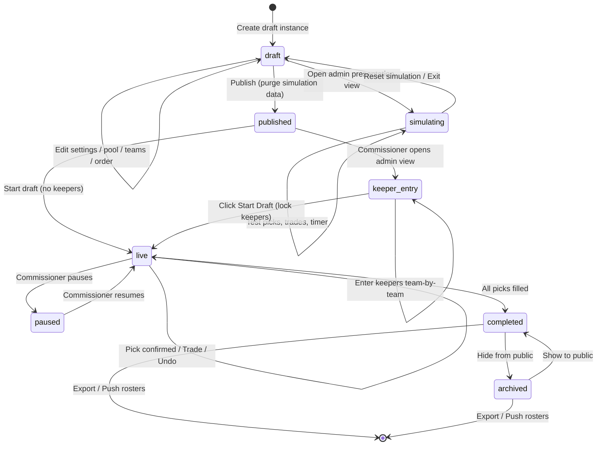
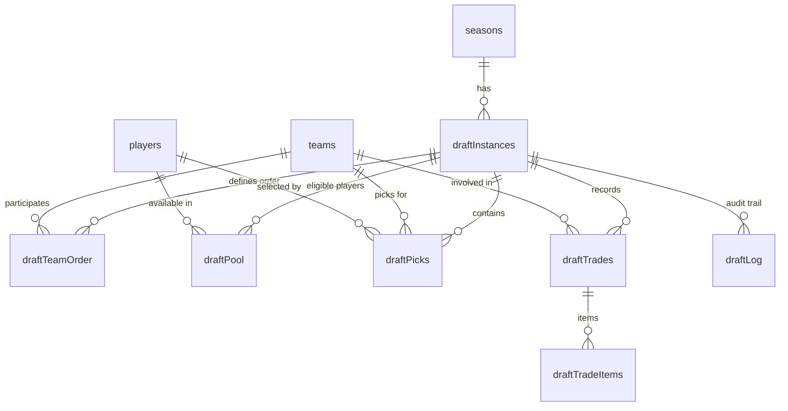

# PRD: Draft Wizard & Live Draft Board

> **Status**: Implemented
> **Author**: Chris Torres
> **Created**: 2026-05-04
> **Parent PRD**: [prd-admin-page.md](./prd-admin-page.md)

## 1. Overview

### Description

A dedicated, interactive draft system for managing the BASH league draft process. This replaces the current spreadsheet-based drafting system with three distinct components:

1. **Draft Setup Wizard** (Admin) — Create, configure, and stage an upcoming draft instance
2. **Admin Presentation View** (Admin) — Live draft controls including pick entry, trades, timer management, and draft order editing
3. **Public Presentation View** (Public) — A read-only live board at a public URL for captains, players, and fans to follow in real-time on desktop or mobile

### Primary Users

| Role | Access | Description |
|---|---|---|
| **Commissioner** | Admin (PIN auth) | Sets up the draft, controls the live board, enters picks, manages trades and timing |
| **Public** | Read-only (public URL) | Captains, players, and fans — everyone sees the same live read-only presentation |

> [!NOTE]
> Captains do **not** have a separate interactive role. The Commissioner enters all picks on behalf of captains as final confirmation. Captains view the same public presentation as everyone else.

### Core Goals

- Provide a draft creation wizard for commissioners to configure and stage drafts in advance
- Deliver a presentation view at a public link that works well on both desktop and mobile
- Build an admin presentation view with live draft management capabilities (pick entry, trades, timer, draft order editing)
- Automatically generate league rosters upon draft completion

---

## 2. User Stories

- **User Story 1 (Commissioner — Setup)**: As the Commissioner, I want to create and configure a draft instance in advance — setting the number of rounds, participating teams with their captains for the upcoming season, draft order, draft date, location, and timer settings — so that draft day runs smoothly without manual data entry.

- **User Story 2 (Commissioner — Preview)**: As the Commissioner, I want to preview the draft board while the instance is still staged — verifying team order, keepers, and trades — so I can confirm configuration is correct before publishing. If I need to rehearse the full draft flow, I can publish, start a live draft, and delete/recreate it afterward.

- **User Story 3 (Commissioner — Live)**: As the Commissioner, I want to manage the live draft from an admin view, including entering picks on behalf of captains, executing pick swaps and player trades mid-draft, pausing/resuming the timer, editing draft order, and reverting picks — so the digital board perfectly reflects the real-world draft happening in the room.

- **User Story 4 (Public — Pre-Draft)**: As a player or fan, I want to visit the draft page before draft day and see the scheduled date, time, and location — so I know when and where to show up or tune in.

- **User Story 5 (Public — Live)**: As a player or fan, I want to follow a read-only live link to the Draft Board and see picks being made in real-time, including which team is on the clock and what teams have selected — so I can follow along from home or on my phone.

---

## 3. Functional Requirements

### Must Have (P0)

- **Draft Setup Wizard**: Admin tool to create a draft instance via a 5-step wizard:
  - Draft settings (name, date, time, location, pick timer, draft format, number of rounds, max keepers per team)
  - Eligible player pool import (from registration data, CSV, or manual entry)
  - Participating teams, captains, and franchise assignment
  - Draft order and pre-draft trades
  - Review and create

- **Player Pool Import**: The player pool defines the universe of eligible players for the draft. Importing the pool early (Step 2) ensures the captain selection, keeper entry, and live pick search all draw from the same validated list.
  - Use the current player list from the database (currently 164 players) as the base pool
  - Import Sportability Roster from CSV (reuses the same import functionality as the admin Players tab)
  - Manual entry (add individual players)
  - The pool can be edited after creation on the draft management page

- **Team & Captain Configuration**: The commissioner defines participating teams and designates captains during draft setup (Step 3). Teams may optionally be configured in advance via the admin **Teams tab** (under season management), but this is not a hard prerequisite — the draft wizard supports full team setup as well:
  - **Pre-populated from admin**: If teams have already been added to the season via the admin Teams tab, they are pre-populated in Step 3 of the wizard. The commissioner can review, edit team names, and add/edit captains.
  - **Add from franchise**: Select an existing franchise (e.g., "Red", "Blue") to add a team. The wizard shows the franchise's previous season team name and captains as defaults, editable by the commissioner.
  - **New team/franchise**: Create a new team name (and optionally a new franchise) and designate captains — either by selecting existing players from the pool (imported in Step 2) or entering new player names (which creates new player records)
  - **Captain designation**: 1–2 captains per team, selected by searching the imported player pool or entering new names
  - **Source of Truth**: Because the draft locks in rosters and keepers, the draft wizard acts as the final source of truth for captains. Modifying, adding, or removing captains during draft setup will automatically clear old captains and sync the official team captains to the season (`player_seasons`) upon creation.
  - Captain designations are editable on the draft management page until the draft transitions to `live`

- **Draft Order & Pre-Draft Trades** (Step 4): After teams are defined, the commissioner sets the pick order and configures any trades that were agreed upon before the draft:
  - **Draft order**: Drag teams to set pick order (first pick → last pick). Per BASH Rule 204, last-place team picks first, champion picks last — but this is manually set for now (auto-calculation from standings is P2).
  - **Pre-draft trades**: Configure pick swaps agreed upon before draft day (e.g., Team A trades their Round 3 pick to Team B for Team B's Round 5 pick). These are recorded in the `draftTrades` table and reflected on the board from the start.
  - **Chain trades**: Trades are entered in order and support chain scenarios where a pick acquired in one trade is traded again in a subsequent trade. For example:
    - Trade 1: Team A trades Rd 1 pick ↔ Team B trades Rd 3 pick
    - Trade 2: Team B trades Rd 1 pick (acquired from Team A in Trade 1) ↔ Team C trades Rd 4 pick
  - **Display vs Resolution**: The UI stores and displays trades in their human-readable swap format (as entered by the admin). Under the hood, a **sequential resolution engine** processes trades top-to-bottom to compute the net pick ownership map:
    1. Initialize an ownership map: each `{originalTeamSlug, round}` slot → owned by `originalTeamSlug`
    2. For each trade in order, look up the current owner of both picks and swap ownership
    3. The final ownership map determines `teamSlug` on pre-generated `draftPicks` rows
  - **Acquired-pick indicator**: When configuring Trade N, if a pick's current owner differs from its original owner (due to a prior trade), the UI shows a `(via OriginalTeam)` annotation so the admin can verify the chain is correct
  - Each side of a trade specifies: the team trading, the round, and the **original owner** of the pick (defaults to the trading team's own pick; set to a different team for acquired picks)

- **Keeper Lists (Draft-Day Entry)**: Keepers are entered in the admin presentation view on draft day — not during setup — because keeper decisions are typically finalized only hours before the draft starts. Each team can designate up to the configured max keepers (set in Step 1, default 8) from the previous season's roster, pre-slotted into specific draft rounds:
  - The admin presentation view opens in a **"Pre-Draft: Enter Keepers"** phase before the commissioner starts the draft
  - Commissioner selects keepers team-by-team and assigns each to a round
  - By default, keepers fill rounds sequentially starting from Round 1 (e.g., 4 keepers → Rounds 1–4)
  - The commissioner can override any keeper's round assignment (e.g., a keeper slotted into Round 12 instead of the default)
  - The board live-previews pre-filled keeper picks as they are entered
  - When the commissioner clicks **"Start Draft"**, keeper picks are locked and the draft begins — skipping any keeper-occupied picks automatically
  - When the draft reaches a round/pick occupied by a keeper, that pick is **auto-confirmed** with the kept player — no timer needed, the draft advances immediately
  - The board visually distinguishes keeper picks from live draft picks (e.g., a "K" badge or distinct color)
  - **Captain enforcement**: Players designated as captains for the upcoming season (set during draft setup, Step 3) are auto-suggested as keepers and a validation warning is shown if a team's captain(s) are not included in the keeper list. Captains must be kept per BASH Rule 203.
  - Example: Team A keeps 4 players → picks 1–4 are pre-filled. Team B keeps 3 players but one is slotted in Round 12 → picks 1, 2, and 12 are pre-filled

- **Draft Instance Lifecycle**: A draft instance progresses through these states:
  - `draft` — Visible only to admins for configuration and simulation/preview
  - `published` — Visible at a public URL for captains, players, and fans
  - `live` — Draft is actively in progress
  - `paused` — Commissioner has temporarily paused the draft (must resume before completing)
  - `completed` — All rounds finished, results available
  - `archived` — Removed from site-wide announcements, but direct link remains active (Full Board view only)

  Valid transitions: `draft → published` (purge simulation), `published → live` (start draft), `live → paused`, `paused → live` (resume only — cannot transition directly to `completed` from `paused`), `live → completed`, `completed → archived`, `archived → completed`.

- **Site-Wide Announcements via `SiteBanner`**: When a draft is `published` or `live`, the unified `SiteBanner` component (in `components/site-banner.tsx`) displays a dismissable announcement banner across all public pages (except `/admin` and `/draft`). The banner links to the draft's public URL and is prioritized over registration announcements:
  - **Live**: Pulsing green dot + "BASH Draft is LIVE — Watch the picks unfold"
  - **Published**: Subtle dot + "BASH Draft Board is now available"
  - Each status is independently dismissable via `localStorage` (keyed by season slug + status), so dismissing the "published" banner doesn't suppress the "live" banner when the draft goes live.
  - The `SiteBanner` replaces the previous approach of adding a dedicated draft link to the `SiteHeader` navigation bar. This centralizes all ephemeral site announcements (registration, draft) into a single, consistent dismiss-to-hide UX pattern.

- **Simulation / Preview Mode**: While in the `draft` state, the commissioner can open the admin presentation view and run a full simulated draft:
  - All admin controls are functional: pick entry, trades, timer, order editing, undo
  - A prominent **"SIMULATION MODE"** banner is displayed across the top to prevent confusion with a real draft
  - Simulation picks and trades are stored in the database with a `isSimulation: true` flag so they can be cleanly separated
  - **"Reset Simulation"** button clears all simulation picks, trades, and log entries with a single click, returning the draft to a clean pre-start state
  - Simulation can be run multiple times — reset and re-simulate as needed
  - When the commissioner publishes the draft, any remaining simulation data is automatically purged
  - **Public view preview**: A preview link to the public presentation view is available during simulation, but requires admin authentication (scorekeeper PIN). This lets the commissioner verify exactly what viewers will see on draft day — board layout, franchise colors, timer, responsive behavior — without making the page publicly accessible. The preview URL follows the same pattern as the public link (e.g., `/draft/[id]?preview=true`) and shows a subtle "PREVIEW — NOT PUBLIC" badge.

- **Live Draft Board (Public)**: A real-time presentation view displaying:
  - The draft grid/board showing all teams and their picks. Traded picks display the franchise color of the team that now owns the pick, making trade activity immediately visible on the board.
  - **Progressive grid disclosure**: The board shows completed rounds + the current round + 2 upcoming rounds. Remaining future rounds are collapsed into a summary row ("8 rounds remaining"). This prevents empty rows from dominating the viewport — critical for projector displays where above-the-fold space is premium. The grid auto-scrolls to keep the current pick visible when new picks are made.
  - **Placeholder cards**: Visible upcoming rounds (within the disclosed window) display faded/dimmed placeholder cells. Traded picks show a compact franchise-colored swap badge (⇄) instead of verbose text, with the acquiring team name on hover/tap.
  - **Sticky team headers**: Team column headers remain fixed at the top of the grid when scrolling, ensuring team identification is always visible. A floating "Jump to current round" button appears when the active round is scrolled out of view.
  - Which team is currently on the clock, plus the next 3 teams on deck with upcoming picks
  - Full history of picks as they happen
  - Which team made each pick (team name and branding)
  - Pick timer countdown with contextual state labels (see "Draft Timer" below)
  - **"The Pick Is In" animation**: When a new pick is confirmed, a brief (2.5-second) broadcast-style announcement moment plays:
    1. A full-width overlay banner slides down from the hero card area with the franchise color as background
    2. The banner displays: team name (bold, uppercase) + "SELECT" + player name (large, white text)
    3. The banner holds for 1.5 seconds, then fades out with a smooth opacity transition
    4. Simultaneously, the newly filled cell in the grid receives a **golden highlight flash** (`@keyframes` from amber-200 → transparent over 3 seconds) to draw the eye to where the pick landed on the board
    5. On mobile, the banner is compact (single line) and auto-dismisses after 2 seconds
    6. Keeper auto-confirms skip the banner animation (keepers are expected, not announced)
  - **Draft chime audio**: An NHL-style draft chime (`public/sounds/nhl-draft-chime.mp3`, 3.5s trimmed clip with fade-out) plays automatically when a new pick is detected on the public board. The chime fires within the SWR pick-detection `useEffect` and gracefully handles browser autoplay restrictions (silent catch on play rejection). A **mute toggle** (🔊/🔇 button) is rendered in the live header, with the mute preference persisted via `localStorage` (`bash-draft-muted`). Uses `useRef` for mute state to avoid stale closures in the effect callback.
  - **Pick highlight animation**: All newly filled cells (detected by comparing previous SWR data with new data) receive a brief golden glow (`bg-amber-100` → transparent, 3s ease-out) to draw attention to board changes, even when the viewer's eyes are elsewhere.
  - **Available Players tab**: A secondary tab alongside the draft board showing all players in the eligible pool who have **not** yet been drafted. Includes a search input to filter by name. Selecting a player who has already been drafted shows their draft team and round in the player card. Players who are keepers display a "K" badge; goalies display a "G" badge (both badges shown simultaneously for keeper goalies).
  - Works well on desktop and mobile
  - **Mobile layout**: The mobile view uses a tab-based interface with "Draft Board" and "Available Players" tabs. Layout from top to bottom:
    - **Latest pick banner** — A single-line summary of the most recent pick (e.g., "R5P4: Loons → A. McGrath") replacing the horizontal ticker, which is too cramped on narrow screens. Tappable to expand into the last 5 picks.
    - **On-the-clock card** — Compact hero card with team name, franchise color accent, round/pick info, and countdown timer
    - **Draft Board tab** — Horizontally scrollable grid (same as desktop) with progressive disclosure. Team headers are sticky.
    - **Available Players tab** — Searchable undrafted player list with position badges

- **Commissioner Controls (Admin Presentation View)**: The admin view includes all public presentation content plus:
  - **Available Players tab** — Same as the public tab (searchable undrafted list with badges), but the commissioner uses it to locate players for pick entry
  - **Pick Entry**: Select a player for the current team. Pick is confirmed immediately — no multi-second revert window. If the commissioner makes a mistake, they use "Undo Last Pick" or "Go to Pick #" to correct it.
  - **Undo Last Pick**: Quick undo that reverts the most recent pick without corrupting draft order. The undone player returns to the available pool.
  - **Pick Swap**: Swap draft picks between teams (e.g., Team A's Round 2 Pick 4 for Team B's Round 3 Pick 1)
  - **Player Trades**: Move a player already drafted from one team to another
  - **Timer Controls**: Pause/resume the pick timer at any time; adjust the timer duration mid-draft
  - **Draft Order Editing**: Modify the draft order during the draft
  - **Navigate to Previous Pick**: Return to any previous pick and edit it at any time

- **Draft Timer**: Visual countdown clock for the current pick. Timer behavior:
  - **Timer state labels**: The timer display includes a contextual label to eliminate ambiguity:
    - **Running**: Shows countdown digits only (e.g., `1:42`), no label needed
    - **Expired**: Displays **"0:00"** with **"TIME'S UP"** label and a pulsing red indicator. No audible buzzer.
    - **Paused**: Displays remaining time with an **"PAUSED"** label in amber
    - **Awaiting**: When the timer hasn't started for the current pick (e.g., between picks or during keeper auto-advance), shows **"AWAITING PICK"** in muted text instead of digits
  - The timer **stays at 0:00** ("EXPIRED" state) — the commissioner can still make the pick at their leisure. The timer is advisory, not a hard cutoff.
  - The timer **only resets and starts** when the next pick is entered/confirmed by the commissioner. It does not auto-start.
  - Timer state is **persisted server-side** using the same pattern as the live scorekeeping tool: `timerSeconds` (countdown remaining), `timerRunning` (boolean), and `timerStartedAt` (timestamp). The client computes the current countdown as `remaining = timerSeconds - (now - timerStartedAt)`. This ensures crash recovery — if the commissioner's browser disconnects, reopening the admin view resumes the timer exactly where it was.

- **Post-Draft**:
  - **Roster Export**: Export the full draft results as a list of player names and team assignments (CSV/clipboard)
  - **Roster Push**: One-click sync of draft results to populate the active season's official rosters in the database (`player_seasons` + `season_teams`). Uses `INSERT ... ON CONFLICT DO UPDATE` (upsert) to handle players who may already have `player_seasons` records for the current season.

- **Draft Backup & Restore**: Available from a 3-dot menu on the draft management page:
  - **Download Config**: Export the full draft configuration (settings, teams, order, keepers, pool) as a JSON snapshot for disaster recovery
  - **Restore from Config**: Upload a previously exported JSON snapshot to restore draft state. Requires confirmation dialog. Available only in `draft` state.

- **Keeper Minimum**: Every team must have at least 1 keeper (their captain). Captains are always the first keeper for their team. The keeper entry phase auto-populates captains as keepers; the commissioner can add additional keepers up to `maxKeepers`.

- **Summer Draft Variant**: Summer seasons use a simplified draft format. The season type (Fall or Summer) is set during season creation and automatically adjusts the draft wizard behavior:
  - **Keepers: Captains only** — Each team keeps only their captain(s). The max keepers setting is still configurable but defaults to the number of captains (typically 1 per team for summer). The keeper entry phase auto-populates captains and the commissioner confirms.
  - **No trades** — Pre-draft trades (Step 4) and mid-draft trades are disabled. The Trade button is hidden from the admin presentation view. Step 4 of the wizard shows only draft order (the pre-draft trades section is hidden).
  - **1 captain per team** — Summer teams typically designate only 1 captain (Step 3 still supports 1–2 but defaults to 1 for summer seasons).
  - **Random draft order** — Summer draft order is typically decided randomly rather than by previous standings. Step 4 still shows the same drag-to-reorder interface, but adds a **"Randomize Order"** button that shuffles the team order with a visual animation. The commissioner can randomize, then manually adjust if needed, or skip randomization entirely and drag teams into a custom order. A second "Randomize Order" button is also available in the pre-draft keeper phase (just before clicking "Start Draft") for last-minute order decisions on draft day.
  - **Player pool**: Uses the same import methods as fall drafts (database, CSV, manual entry).
  - **All other features** (draft grid, timer, public board, simulation, roster push) work identically to fall drafts.

### Should Have (P1)

- **Pick Trades Management**: Detailed UI for complex multi-pick trades with trade history log
- **Live Updates**: The public board auto-refreshes using SWR polling. Polling intervals: **5-second** for the live draft board, **10-second** for the pre-draft countdown page. Uses the same SWR pattern as the existing live scorekeep tool (`revalidateOnFocus: true`). A dedicated `/api/bash/draft/[id]/live` endpoint serves the current board state as optimized JSON.

### Could Have (P2)

- **Auto Draft Order Calculation**: Automatically compute draft order from previous season standings per BASH Rule 204
- **Draft History Page**: Public page showing historical draft results by season
- **Supplemental Draft Mode**: Separate draft instance type for mid-season supplemental drafts (BASH Rule 206)

---

## 4. UI/UX & Information Architecture

### Pages & Components

#### Draft Setup Wizard (`/admin/seasons/[id]/draft/new`)

Step-by-step admin form to configure the draft instance:

| Step | Name | Description |
|---|---|---|
| 1 | **Settings** | Draft name, date, time, location, pick timer duration (default 2 minutes), draft format (Snake or Linear), number of rounds, max keepers per team (default 8) |
| 2 | **Player Pool** | Import eligible players via Sportability Roster CSV import (preferred), manual entry, or registration period (when built). Defines the universe of draftable players and captain candidates. |
| 3 | **Teams & Captains** | Pre-populated with teams from the admin Teams tab (if any). Add teams by selecting an existing franchise or creating a new one. Edit team names, add/remove teams, and designate 1–2 captains per team from the imported player pool. |
| 4 | **Draft Order & Pre-Draft Trades** | Set team pick order (drag to reorder). Configure any pre-draft pick swaps agreed upon before draft day. |
| 5 | **Review & Create** | Summary of all settings. "Create as Draft" (admin-only) or "Create & Publish" (goes live immediately) |

#### Admin Presentation View (`/admin/seasons/[id]/draft/live`)

The Commissioner's command center during **simulation** (draft state), **keeper entry** (pre-draft on draft day), and **live** drafts. The view has two phases:

**Phase 1 — Pre-Draft: Enter Keepers** (shown before the draft starts):
- The Big Board is visible but empty (or showing simulation data if in draft state)
- **Keeper Entry Panel** replaces the pick controls:
  - Team selector dropdown — pick which team to configure
  - Player search within the eligible pool for that team
  - For each keeper: assign to a round (defaults to next sequential round, draggable to any open round)
  - Running summary: "Team A: 4 keepers (R1–R4) | Team B: 3 keepers (R1, R2, R12) | Team C: 0 keepers"
  - Board live-previews keeper picks as they're entered (shown with "K" badge)
- **"Start Draft"** button — locks all keeper picks and begins Round 1 (requires confirmation dialog)
- Keeper entry is optional — if no keepers are entered, the commissioner can start the draft immediately

**Phase 2 — Live Draft** (after "Start Draft" is clicked):
- **The Big Board** — Full draft grid identical to the public view (high-contrast, TV-friendly), with keeper picks pre-filled and badged
  - Each team's column header uses the **franchise color** as a background tint (pulled from `franchises.color` via `season_teams.franchiseSlug`)
  - Pick cards for each team use a subtle franchise color accent (border or background wash)
  - The **"on the clock"** team's column pulses or glows with an intensified version of the franchise color
- **Control Panel** (sidebar or bottom bar):
  - Current pick info: Team name, round, pick number
  - Player search/filter with quick-select
  - Pick confirmation dialog (5-second revert countdown)
  - Timer display with Pause / Resume / Adjust buttons
  - "Trade" button → opens trade modal
  - "Edit Order" button → opens order editor
  - "Go to Pick #..." → navigate to any previous pick for editing
- **Trade Modal**: Two-pane interface for pick swaps and player trades
  - Left: Team A picks/players
  - Right: Team B picks/players
  - Drag or select items to swap, confirm trade
- **Tabbed Content Area**: The Big Board and Draft Log are organized as tabs in the main content area (left panel):
  - **Board tab** (default) — The full draft grid as described above
  - **Draft Log tab** — A full-height, chronological activity feed of every draft event with timestamps. Entry types:
    - **Pick**: "10:42 AM — R5P2: Cherry Bombs select Sarah Kim (Skater)" with franchise color dot
    - **Keeper**: "10:00 AM — R1P1: Red Army keep James Wilson (K)" in orange-tinted row
    - **Trade**: "10:35 AM — Trade #2: Red Army R7P1 ↔ Loons R9P3" in amber-tinted row
    - **Undo**: "10:43 AM — Undo: R5P2 pick reverted" in red-tinted row with strikethrough
    - **Timer**: "10:41 AM — Timer expired for Loons (R5P3)" in muted text
  - The log is scrollable with newest entries at top. A filter dropdown allows showing All / Picks only / Trades only / Undos only.
  - A small draft log summary (last 3 entries) remains visible in the Control Panel sidebar regardless of which tab is active, so the commissioner always has context.

**Simulation Controls** (visible only in `draft` state, available in both phases):
- **"SIMULATION MODE"** banner across the top of the view
- **"Reset Simulation"** button — clears all test picks/trades/keepers, resets board to clean state
- **"Exit Preview"** button — returns to the draft setup/management page

#### Public Presentation View (`/draft/[season]`)

A dedicated public page accessible via a shareable, season-based URL (e.g., `/draft/2026-2027`).

**Before draft day** (draft is `published` but not started):
- Displays draft date, time, and location
- "Draft starts in X days / hours" countdown
- Season name and participating teams

**During the draft** (live):
- **The Big Board** — Real-time grid of all teams and their picks
  - Team columns/rows are tinted with franchise colors for instant visual identification
  - The "on the clock" team's section pulses with an intensified franchise color glow
  - **Progressive grid disclosure**: Shows completed rounds + current round + 2 upcoming rounds; remaining rounds collapsed into a summary row. Grid auto-scrolls to keep the current pick visible.
  - Keeper picks show a "K" badge with amber filled background; keeper goalies show both "K" and "G" badges. Captain picks show a "C" badge with blue background. Badges are `w-5 h-5` for projector readability.
- **"The Pick Is In" animation** — Broadcast-style pick announcement (see §3 P0 for full spec). Banner slides down with franchise color + player name, holds 1.5s, fades out. Grid cell receives golden highlight flash simultaneously.
- **Draft chime audio** — NHL-style chime plays on each new pick with a mute toggle in the header (see §3 P0 for full spec).
- **Available Players tab** — Tabbed alongside the board, showing all undrafted players with a search bar. Tapping a drafted player shows their assigned team. Goalies are badged.
- Current team "on the clock" with visual highlight and contextual timer labels (Running / Expired / Paused / Awaiting)
- **Recent picks ticker** (desktop) — Horizontally scrolling strip with most recent selections. Auto-scrolls to keep newest pick visible at the left edge.
- Responsive layout: grid view on desktop, optimized compact layout on mobile
- **Mobile**: Layout from top to bottom:
  - **Latest pick banner** — Single-line summary of the most recent pick (e.g., "R5P4: Loons → A. McGrath"). Tappable to expand into last 5 picks. Replaces the desktop ticker which is too cramped on narrow screens.
  - **On-the-clock card** — Compact hero card with team name, franchise color accent, round/pick info, and countdown timer with state labels.
  - **Tab bar** — "Draft Board" and "Available Players" tabs.
  - **Draft Board tab** — Horizontally scrollable grid with progressive disclosure and sticky team headers.
  - **Available Players tab** — Searchable undrafted player list with position badges.
- **Presentation mode**: A toggle that maximizes the board into a fullscreen, chrome-free layout optimized for casting to a TV at the draft party (hides nav, footer, and non-essential UI)
- **Paused state**: When the commissioner pauses the draft, the "LIVE" badge is replaced with an amber **"PAUSED"** badge. The board dims slightly (opacity 0.7) and the hero card timer area shows "DRAFT PAUSED". This prevents viewers from thinking their connection dropped.

**After the draft** (completed):
- **"Draft Complete" hero card** with summary stats: total picks, total rounds, number of teams, draft duration (computed from `createdAt` to last `pickedAt`). Replaces the "On the Clock" hero.
- **"By Team" roster view** (default) — Team cards in a 2-column grid, each with a franchise-colored top border, listing all picks with round numbers and K/R/G badges. This is the primary post-draft view for captains checking rosters.
- **"Full Board" view** — Final grid showing all picks by team and round. Available as a secondary tab.
- Link to the season roster page ("View Full Rosters →" CTA)
- **Mobile completed view**: Uses the same "By Team" card layout (team-grouped with franchise-colored headers), without the ticker or on-the-clock card. Tabs show "By Team" (default) and "Full Board".

### User Workflows



### Draft Instance States

| State | Admin Visibility | Public Visibility | Description |
|---|---|---|---|
| `draft` | ✅ Full access + simulation | ❌ Hidden | Being configured and tested by commissioner. Admin can preview the full presentation view and run simulated drafts. |
| `published` | ✅ Full access | ✅ Pre-draft info only | Public page shows date/time/location countdown. All simulation data has been purged. |
| `live` | ✅ Admin controls | ✅ Real-time board | Draft is actively in progress |
| `paused` | ✅ Admin controls | ✅ Board visible (paused) | Commissioner has paused the draft |
| `completed` | ✅ Results + export | ✅ Final board | All rounds finished, results available in footer |
| `archived` | ✅ Results + export | ✅ Final board (direct link only) | Draft is removed from `SiteBanner` announcements. |

---

## 5. Technical Architecture & Data Models

### Schema Changes to Existing Tables

```typescript
// ─── franchises (new table) ─────────────────────────────────────────────────

// Represents a persistent franchise identity across seasons. In BASH, franchises
// are typically identified by their color (e.g., the "red" franchise has been
// Cherry Bombs, Red Army, No Regretzkys across different seasons).
// Franchise color is used for draft board theming, team pages, and standings accents.

export const franchises = pgTable("franchises", {
  slug: text("slug").primaryKey(),                   // e.g. "red", "blue", "black"
  name: text("name").notNull(),                      // e.g. "Red Franchise"
  color: text("color"),                              // hex color e.g. "#DC2626"
})

// ─── season_teams (existing table — add franchiseSlug) ──────────────────────

// Migration: ALTER TABLE season_teams ADD COLUMN franchise_slug text REFERENCES franchises(slug);
//
// Links a season-specific team to its franchise for cross-season stat aggregation
// and consistent color theming. Optional FK — not all historical teams may be mapped.

export const seasonTeams = pgTable(
  "season_teams",
  {
    // ... existing fields (seasonId, teamSlug) ...
    franchiseSlug: text("franchise_slug")              // NEW
      .references(() => franchises.slug),
  },
)

// ─── player_seasons (existing table — add isCaptain) ────────────────────────

// Migration: ALTER TABLE player_seasons ADD COLUMN is_captain boolean NOT NULL DEFAULT false;
// Migration: ALTER TABLE player_seasons ADD COLUMN is_rookie boolean NOT NULL DEFAULT false;
//
// isCaptain: Designates 1–2 players per team per season as team captains (BASH Rule 102).
// Set during draft setup (Step 2: Teams & Captains) for the upcoming season.
// Used by the draft keeper entry phase to auto-suggest and validate that
// captains are included in each team's keeper list (BASH Rule 203).
//
// isRookie: Designates players who are in their first season of BASH (legacy support).

export const playerSeasons = pgTable(
  "player_seasons",
  {
    // ... existing fields (playerId, seasonId, teamSlug, isGoalie) ...
    isCaptain: boolean("is_captain").notNull().default(false),  // NEW
    isRookie: boolean("is_rookie").notNull().default(false),  // NEW
  },
)
```

### New Draft Tables (Drizzle schema additions to `lib/db/schema.ts`)

```typescript
// ─── Draft Instances ────────────────────────────────────────────────────────

export const draftInstances = pgTable("draft_instances", {
  id: text("id").primaryKey(),                       // gen-[UUID]
  seasonId: text("season_id")
    .notNull()
    .references(() => seasons.id),
  seasonType: text("season_type").notNull().default("fall"), // snapshot from seasons.seasonType at creation time
  name: text("name").notNull(),                      // e.g. "2026-2027 BASH Draft"
  status: text("status").notNull().default("draft"), // draft | published | live | paused | completed
  isSimulating: boolean("is_simulating").notNull().default(false), // true when admin is running a simulation
  draftType: text("draft_type").notNull().default("snake"), // snake | linear
  rounds: integer("rounds").notNull().default(14),
  timerSeconds: integer("timer_seconds").notNull().default(120), // default pick timer duration
  maxKeepers: integer("max_keepers").notNull().default(8),        // max keepers per team
  draftDate: timestamp("draft_date", { withTimezone: true }),
  location: text("location"),                        // e.g. "The Connecticut Yankee"
  currentRound: integer("current_round"),
  currentPick: integer("current_pick"),
  // Timer state — follows same pattern as LiveGameState in scorekeeper-types.ts
  // Client computes: remaining = timerCountdown - (Date.now() - timerStartedAt) / 1000
  timerCountdown: integer("timer_countdown"),         // seconds remaining when timer was last started/paused
  timerRunning: boolean("timer_running").notNull().default(false),
  timerStartedAt: timestamp("timer_started_at", { withTimezone: true }), // when clock was last started
  createdAt: timestamp("created_at", { withTimezone: true }).defaultNow(),
  updatedAt: timestamp("updated_at", { withTimezone: true }).defaultNow(),
})

// ─── Draft Team Order ───────────────────────────────────────────────────────

export const draftTeamOrder = pgTable(
  "draft_team_order",
  {
    draftId: text("draft_id")
      .notNull()
      .references(() => draftInstances.id, { onDelete: "cascade" }),
    teamSlug: text("team_slug")
      .notNull()
      .references(() => teams.slug),
    position: integer("position").notNull(),          // 1-indexed order
  },
  (t) => [
    primaryKey({ columns: [t.draftId, t.teamSlug] }),
    index("idx_draft_team_order").on(t.draftId, t.position),
  ]
)

// ─── Draft Pool (Eligible Players) ──────────────────────────────────────────

export const draftPool = pgTable(
  "draft_pool",
  {
    draftId: text("draft_id")
      .notNull()
      .references(() => draftInstances.id, { onDelete: "cascade" }),
    playerId: integer("player_id")
      .notNull()
      .references(() => players.id),
    isKeeper: boolean("is_keeper").notNull().default(false),
    keeperTeamSlug: text("keeper_team_slug")         // team keeping this player
      .references(() => teams.slug),
    keeperRound: integer("keeper_round"),             // round they're slotted into (e.g., 1, 2, 12)
    registrationMeta: jsonb("registration_meta"),     // Sportability import snapshot (see §5.1)
  },
  (t) => [
    primaryKey({ columns: [t.draftId, t.playerId] }),
    index("idx_draft_pool_draft_player").on(t.draftId, t.playerId), // for undrafted player lookup
  ]
)

// ─── Draft Picks ────────────────────────────────────────────────────────────
// PICK PRE-GENERATION: When the draft transitions to `live`, all pick slots are
// pre-generated as rows with `playerId = null`. For snake drafts, even rounds
// reverse the team order. Keeper picks are immediately filled with `playerId` set
// and `isKeeper = true`. The "current pick" is the first row where
// `playerId IS NULL`, ordered by `pickNumber`.

export const draftPicks = pgTable(
  "draft_picks",
  {
    id: text("id").primaryKey(),                      // gen-[UUID]
    draftId: text("draft_id")
      .notNull()
      .references(() => draftInstances.id, { onDelete: "cascade" }),
    round: integer("round").notNull(),
    pickNumber: integer("pick_number").notNull(),     // overall pick # (1, 2, 3...)
    teamSlug: text("team_slug")                       // team making the pick (may differ from original due to trades)
      .notNull()
      .references(() => teams.slug),
    originalTeamSlug: text("original_team_slug")      // original team before any trades
      .notNull()
      .references(() => teams.slug),
    playerId: integer("player_id")                    // null until pick is made
      .references(() => players.id),
    pickedAt: timestamp("picked_at", { withTimezone: true }),
    isKeeper: boolean("is_keeper").notNull().default(false),      // true for auto-confirmed keeper picks
    isSimulation: boolean("is_simulation").notNull().default(false), // true for simulation picks (purged on publish)
  },
  (t) => [
    index("idx_draft_picks_draft").on(t.draftId),
    index("idx_draft_picks_team").on(t.draftId, t.teamSlug),
    unique("uq_draft_picks_slot").on(t.draftId, t.round, t.pickNumber), // prevent duplicate pick slots
  ]
)

```

### 5.1 Sportability Registration Import (Interim Solution)

> [!IMPORTANT]
> This is a **temporary bridge** for pre-draft planning. The Sportability CSV export is the only registration data source until the native Registration module ([prd-registration.md](./prd-registration.md)) is built. Once the registration module is live, both tools will share the same normalized `registrations` table fields, and the draft pool import will read directly from registration data instead of CSV. See §9 (PR 2) for implementation scope.

#### Field Mapping (Sportability CSV → `registration_meta` JSONB)

Field names are intentionally aligned with the `registrations` table columns defined in [prd-registration.md](./prd-registration.md) §2.3 so that the migration to native registration data requires only changing the data source, not the UI or display logic.

| Sportability CSV Column | `registration_meta` Key | Registration PRD Field | Type | Tier |
|---|---|---|---|---|
| `Birthdate` | `birthdate` | `registrations.birthdate` | `string \| null` (ISO date) | Primary |
| (computed from Birthdate) | `age` | (computed) | `number \| null` | Primary |
| `ExpSkill` | `skillLevel` | `registrations.skillLevel` | `string \| null` | Primary |
| `ExpPos` | `positions` | `registrations.positions` | `string \| null` | Primary |
| `CustomQ1` | `gamesExpected` | `registrationAnswers` (Q1) | `string \| null` | Primary |
| `CustomQ3` | `playoffAvail` | `registrationAnswers` (Q3) | `string \| null` | Primary |
| `CustomQ2` | `goalieWilling` | `registrationAnswers` (Q2) | `string \| null` | Secondary |
| `Rookie` | `isRookie` | (derived — see reg PRD §3.9) | `boolean` | Secondary |
| `CustomRestr` | `isNewToBash` | (derived from restriction) | `boolean \| null` | Secondary |
| `Gender` | `gender` | `registrations.gender` | `string \| null` | Secondary |
| `Buddy Req` | `buddyReq` | — | `string \| null` | Secondary |
| `Captain` | `captainPrev` | `player_seasons.isCaptain` | `string \| null` | Secondary |
| `ExpYrs` | `yearsPlayed` | `registrations.yearsPlayed` | `number \| null` | Context |
| `ExpLeague` | `lastLeague` | `registrations.lastLeague` | `string \| null` | Context |
| `ExpTeam` | `lastTeam` | `registrations.lastTeam` | `string \| null` | Context |
| `Notes` | `miscNotes` | `registrations.miscNotes` | `string \| null` | Context |
| `TShirt` | `tshirtSize` | `registrations.tshirtSize` | `string \| null` | Admin |

> [!NOTE]
> **Custom Question Labels** — Sportability CSV headers are generic (`CustomQ1`, `CustomQ2`, `CustomQ3`). The actual BASH question text is hardcoded for this interim solution:
> - **Q1**: "How many games do you expect to play?"
> - **Q2**: "Are you open to playing goalie?"
> - **Q3**: "Will you make playoffs?"
>
> When the registration module is built, these will be dynamic per-period via `registrationQuestions`.

#### `registration_meta` JSONB Shape

```typescript
interface RegistrationMeta {
  // Primary (above the fold in player card)
  age: number | null
  birthdate: string | null       // ISO date
  skillLevel: string | null      // "Novice" | "Intermediate -" | "Intermediate +" | "Advanced"
  positions: string | null       // raw: "D", "Forward, Wing", "G"
  gamesExpected: string | null   // CustomQ1
  playoffAvail: string | null    // CustomQ3

  // Secondary (below the fold in player card)
  goalieWilling: string | null   // CustomQ2
  isRookie: boolean
  isNewToBash: boolean | null    // from CustomRestr
  gender: string | null          // "M" | "F"
  buddyReq: string | null
  captainPrev: string | null     // "", "Asst", "1"

  // Context (expanded detail)
  yearsPlayed: number | null
  lastLeague: string | null
  lastTeam: string | null
  miscNotes: string | null
  tshirtSize: string | null
}
```

#### Player Card UI (Draft Board)

When a player in the draft pool is clicked, a **Sheet** (slide-over panel from the right) opens with tiered registration data:

- **Header**: Player name, age, skill level badge, primary position
- **Primary section**: Games expected, playoff availability, experience years, previous team/league
- **Secondary section** (collapsible): Goalie willingness, new-to-BASH flag, gender, buddy request
- **Notes section**: Misc notes (availability, personality info from registration)
- **Flags**: Badge chips for Rookie, Captain (prev), Keeper

The player pool list in the draft board also displays inline: **Skill** (color-coded badge), **Position**, **Games Expected**, and **Playoff Avail**.

#### Skill Level Badge Colors

| Level | Badge Style |
|---|---|
| Novice | `bg-slate-100 text-slate-700` |
| Intermediate - | `bg-blue-100 text-blue-700` |
| Intermediate + | `bg-indigo-100 text-indigo-700` |
| Advanced | `bg-amber-100 text-amber-700` |

```typescript
// ─── Draft Trades ───────────────────────────────────────────────────────────

export const draftTrades = pgTable("draft_trades", {
  id: text("id").primaryKey(),                        // gen-[UUID]
  draftId: text("draft_id")
    .notNull()
    .references(() => draftInstances.id, { onDelete: "cascade" }),
  teamASlug: text("team_a_slug")
    .notNull()
    .references(() => teams.slug),
  teamBSlug: text("team_b_slug")
    .notNull()
    .references(() => teams.slug),
  tradeType: text("trade_type").notNull(),            // pick_swap | player_trade
  description: text("description"),                   // human-readable summary
  tradedAt: timestamp("traded_at", { withTimezone: true }).defaultNow(),
  isSimulation: boolean("is_simulation").notNull().default(false), // true for simulation trades (purged on publish)
})

// ─── Draft Trade Items (what was exchanged) ─────────────────────────────────
// For pre-draft trades (before picks are generated), `pickId` is null and
// `round` + `position` identify the pick slot. When picks are pre-generated
// at draft start, these are resolved to actual `pickId`s.

export const draftTradeItems = pgTable(
  "draft_trade_items",
  {
    id: serial("id").primaryKey(),
    tradeId: text("trade_id")
      .notNull()
      .references(() => draftTrades.id, { onDelete: "cascade" }),
    fromTeamSlug: text("from_team_slug")
      .notNull()
      .references(() => teams.slug),
    toTeamSlug: text("to_team_slug")
      .notNull()
      .references(() => teams.slug),
    pickId: text("pick_id")                           // for live pick swaps (null for pre-draft)
      .references(() => draftPicks.id),
    round: integer("round"),                          // for pre-draft trades: which round
    position: integer("position"),                    // for pre-draft trades: which position in that round
    playerId: integer("player_id")                    // for player trades
      .references(() => players.id),
  }
)

// ─── Draft Activity Log ─────────────────────────────────────────────────────

export const draftLog = pgTable("draft_log", {
  id: serial("id").primaryKey(),
  draftId: text("draft_id")
    .notNull()
    .references(() => draftInstances.id, { onDelete: "cascade" }),
  action: text("action").notNull(),                   // pick | trade | undo | pause | resume | order_change | timer_change
  detail: jsonb("detail"),                            // action-specific payload
  isSimulation: boolean("is_simulation").notNull().default(false), // true for simulation log entries (purged on publish)
  createdAt: timestamp("created_at", { withTimezone: true }).defaultNow(),
})
```

#### ER Diagram



### APIs / Endpoints

| Method | Route | Auth | Description |
|---|---|---|---|
| `POST` | `/api/bash/admin/draft` | Admin | Create a new draft instance |
| `GET` | `/api/bash/admin/draft/[id]` | Admin | Get draft instance with full state |
| `PUT` | `/api/bash/admin/draft/[id]` | Admin | Update draft settings |
| `POST` | `/api/bash/admin/draft/[id]/simulate` | Admin | Enter simulation mode (opens admin presentation view in draft state) |
| `POST` | `/api/bash/admin/draft/[id]/reset-simulation` | Admin | Clear all simulation picks, trades, and logs |
| `POST` | `/api/bash/admin/draft/[id]/publish` | Admin | Transition draft → published (auto-purges simulation data) |
| `POST` | `/api/bash/admin/draft/[id]/start` | Admin | Transition published → live |
| `POST` | `/api/bash/admin/draft/[id]/pause` | Admin | Toggle pause/resume |
| `POST` | `/api/bash/admin/draft/[id]/complete` | Admin | Mark draft as completed |
| `PUT` | `/api/bash/admin/draft/[id]/order` | Admin | Update team draft order |
| `PUT` | `/api/bash/admin/draft/[id]/timer` | Admin | Adjust timer duration |
| `POST` | `/api/bash/admin/draft/[id]/pick` | Admin | Submit a pick (with 5s revert window) |
| `POST` | `/api/bash/admin/draft/[id]/undo` | Admin | Undo the last pick |
| `PUT` | `/api/bash/admin/draft/[id]/pick/[pickId]` | Admin | Edit a previous pick |
| `POST` | `/api/bash/admin/draft/[id]/trade` | Admin | Execute a pick swap or player trade |
| `GET` | `/api/bash/admin/draft/[id]/export` | Admin | Export draft results (CSV) |
| `POST` | `/api/bash/admin/draft/[id]/push-rosters` | Admin | Push results to season rosters |
| `GET` | `/api/bash/draft/[season]` | Public | Get public draft state (board, picks, timer) — resolves season slug to draft instance internally |
| `GET` | `/api/bash/draft/[season]/poll` | Public | Lightweight polling endpoint (current state hash + latest picks) |

### Real-Time Strategy

For MVP, use **aggressive short-polling** (3-5 second interval) on the `/api/bash/draft/[id]/poll` endpoint. This endpoint returns a minimal payload:

```typescript
{
  stateHash: string,      // changes on any mutation — client skips re-render if unchanged
  status: string,          // live | paused | completed
  currentRound: number,
  currentPick: number,
  timerRemaining: number,  // seconds
  latestPicks: DraftPick[] // last 5 picks for the ticker
}
```

If the `stateHash` hasn't changed, the client does nothing. If it has, the client fetches the full board state. This keeps bandwidth minimal while maintaining near-real-time feel.

> [!NOTE]
> WebSocket upgrade path: If polling proves insufficient at scale (many concurrent viewers), the same API contract can back a WebSocket implementation later. The `stateHash` diffing pattern works identically over either transport.

### Integrations

- **Registration**: The draft pool can be auto-populated from a completed registration period's paid registrants. Rookies in `registered_unpaid` status are also eligible for the pool.
- **Season Rosters**: Post-draft roster push creates `player_seasons` entries linking each drafted player to their team for the active season.
- **Standings**: Draft order for P2 can be auto-computed from previous season standings via `computeStandings()`.

---

## 6. Layout & Routing

```
app/
  admin/
    seasons/
      [id]/
        draft/
          page.tsx              ← Draft management (setup / status)
          new/
            page.tsx            ← Draft creation wizard (5 steps)
          live/
            page.tsx            ← Admin presentation view (live controls)
  draft/
    [season]/
      page.tsx                  ← Public presentation view (read-only, season-based URL)
```

---

## 7. Edge Cases & Constraints

| Scenario | Handling |
|---|---|
| **Uneven teams** | Some teams may have more/fewer picks due to keeper counts or trades. The grid handles irregular row counts per team. |
| **Pick correction** | "Undo Last Pick" button immediately reverts the most recent pick. For older picks, "Go to Pick #" navigates back to edit. No multi-second revert window — mistakes are corrected via explicit undo. |
| **Mid-draft trades** | Pick swaps update `draftPicks.teamSlug` for the affected picks. Player trades update the player's team assignment and are logged in `draftTrades`. |
| **Commissioner misclick** | "Undo Last Pick" button immediately available. For older picks, "Go to Pick #" navigates back to edit. |
| **Browser disconnect** | Admin presentation view auto-reconnects. Draft state (including timer) is fully server-side — reconnecting resumes exactly where it was. Timer uses `timerCountdown` + `timerRunning` + `timerStartedAt` fields for crash-proof state. |
| **Mobile viewers** | Public view uses responsive design: table-format layout on mobile, grid on desktop. Ticker and "on the clock" team are always above the fold. |
| **Draft with keepers** | Keeper players are pre-slotted into their designated rounds (default: sequential from R1, or commissioner-assigned). When the draft reaches a keeper pick, it is auto-confirmed with no timer. The board shows a "K" badge on keeper picks. |
| **Keeper in late round** | A keeper slotted into Round 12 means that team's Round 12 pick is pre-filled. All other rounds for that team proceed as normal draft picks. The grid correctly shows the gap (e.g., Rounds 3–11 are open picks, Round 12 is a keeper). |
| **Keeper on traded round** | During keeper entry, the round assignment dropdown only shows rounds the team currently owns (accounting for trades). If a team traded away R3, that round is not available for keeper assignment. Validation message: "Round 3 is owned by [Team] (Trade #1). Choose a different round." |
| **Keeper count varies by team** | Teams may have 1–8 keepers (minimum 1 — the captain). The board and draft order engine handle asymmetric keeper counts gracefully — teams with fewer keepers simply have more open picks in early rounds. |
| **Captain not kept** | Captains are auto-populated as keepers. If manually removed, a validation error prevents proceeding: "Each team must keep at least their captain(s) per BASH rules." The commissioner cannot override this — captains must always be keepers. |
| **No registration module yet** | Draft pool is populated via Sportability CSV import (interim solution, see §5.1) or manual entry. Registration metadata is stored as a JSONB snapshot on `draft_pool.registration_meta`. When the native registration module is built, the import will read from `registrations` table directly. |
| **Simulation data leaking** | All simulation picks/trades are tagged with `isSimulation: true`. Publishing auto-deletes all rows where `isSimulation = true`. Reset button does the same. All queries on `draftPicks`, `draftTrades`, and `draftLog` must include `WHERE isSimulation = false` by default (use `withoutSimulation` helper). |
| **Accidental publish during simulation** | Publishing requires an `AlertDialog` confirmation ("This will clear all simulation data and make the draft page public. Continue?"). |
| **Timer expiry** | Timer shows "0:00" with "TIME'S UP" label and pulsing red indicator. Commissioner can still make the pick (advisory timer). Timer resets only when next pick is confirmed. |
| **Timer not started** | When the timer hasn't been started for the current pick (e.g., between picks), the hero card shows "AWAITING PICK" in muted text instead of "0:00" to avoid confusion with the expired state. |
| **Draft paused** | When the commissioner pauses, the board dims (opacity 0.7), the LIVE badge is replaced with an amber PAUSED badge, and the timer shows the remaining time with a "PAUSED" label. This prevents viewers from thinking their connection dropped. |
| **Long draft (20+ rounds)** | Progressive grid disclosure shows only completed + current + 2 upcoming rounds. Remaining rounds collapsed into a summary row. Sticky team headers stay fixed during scroll. A floating "Jump to current round" button appears when active round is out of view. |
| **Pick announcement overlap** | If a new pick is confirmed while the "Pick Is In" banner is still visible (rapid-fire picks), the current banner immediately dismisses and is replaced by the new one. Keeper auto-confirms skip the banner entirely. |
| **Roster push conflicts** | Roster push uses `INSERT ... ON CONFLICT DO UPDATE` (upsert) to handle players who already have `player_seasons` records. Discrepancies are logged. |
| **Route visibility** | `/draft/[season]` returns 404 if the draft status is `draft` (admin-only). Implemented as middleware check. |

---

## 8. BASH Rulebook Integration

The following BASH rules (Rulebook 2019) directly inform draft wizard behavior:

| Rule | Enforcement | Implementation |
|---|---|---|
| **Rule 102: Captains** | 1–2 captains per team, must be designated on keeper/protected list | `player_seasons.isCaptain` field; designated during draft setup (Step 2: Teams & Captains) for the upcoming season, auto-suggested as keepers during pre-draft entry with validation warning if omitted |
| **Rule 203: Keeper / Protected Lists** | 1–8 keepers per team, captains in rounds 1–2 | `draftPool.isKeeper`, `keeperRound` fields; keeper entry in admin presentation view (pre-draft phase) with per-player round assignment |
| **Rule 204: Draft Order** | Last place picks first, champion last | P2: auto-calculation from standings. P0: manual ordering |
| **Rule 204: Preliminary vs Regular Rounds** | Until equal roster sizes, then fill to 14 | Draft rounds handle variable team picks via the keeper slotting system |
| **Rule 202: Pickup Eligibility** | Must attend ≥1 pickup | Not enforced by software; commissioner's discretion |

---

## 9. Implementation Phases

### PR 1 — Schema + PRD ✅ (completed — `torres_draft` branch)
- Database schema migration: `franchises` table, `franchise_slug` on `season_teams`, `is_captain` and `is_rookie` on `player_seasons`, all new draft tables (`draftInstances`, `draftTeamOrder`, `draftPool`, `draftPicks`, `draftTrades`, `draftTradeItems`, `draftLog`)
- Draft PRD document (`docs/prd-draft.md`)
- Schema validation script (`scripts/test-draft-schema.ts`)
- **Status**: Pending PR merge

### PR 2 — Draft Wizard (Steps 1-5) + CRUD ✅ (completed — `torres_draft2` branch)
- Draft creation wizard (5-step form): Settings, Player Pool, Teams & Captains, Draft Order & Pre-Draft Trades, Review & Create
- Draft instance CRUD (create, edit, delete)
- Draft pool management (manual player entry + Sportability CSV import with `registration_meta`)
- **Sportability CSV → Draft Pool Import** (interim registration data, see §5.1):
  - Add `registration_meta` JSONB column to `draft_pool` table
  - Build import endpoint: parse CSV, resolve/create players, store registration metadata as JSONB
  - Reuse existing `parseCsv` / `splitCsvRow` helpers from roster import
  - Two-step flow: preview (stats + parsed players) → confirm (insert into pool)
- **Player Card (Sheet)**: Click-to-inspect player detail panel in draft board
  - Reads `registration_meta` from pool entry
  - Tiered layout: Primary (skill, position, games, playoffs) → Secondary (goalie, rookie, gender, buddy) → Notes → Flags
  - Inline skill-level badges on pool list rows
- Draft state machine: `draft → published` transitions (with unpublish support)
- **Chain trade resolution engine** (`lib/draft-trade-resolver.ts`): Sequential ownership tracking for pre-draft trades, including acquired-pick `(via Team)` annotations in the wizard UI
- Multi-captain support: up to 2 captains per team with persistent search
- Add `seasonType`, `timerCountdown`, `timerRunning`, `timerStartedAt` columns to `draftInstances` (additive schema migration)
- Add `round`, `position` columns to `draftTradeItems` (additive)
- Add `uq_draft_picks_slot` unique constraint, `idx_draft_pool_draft_player` index
- Replace admin Draft tab placeholder with real draft management page
- **Smoke test**: ✅ Create a draft via wizard, import Sportability CSV, verify player cards with registration data, publish/unpublish/delete draft

### PR 3 — Admin Presentation View (Simulation + Keeper Entry) ✅ (completed — `torres_draft2` branch)
- Simulation mode: full admin presentation view in `draft` state with "SIMULATION MODE" banner
- Simulation reset (clear all `isSimulation = true` rows)
- Pre-draft keeper entry phase (team-by-team, round assignment with trade-aware validation, board preview)
- Pick pre-generation logic (generate all pick slots when transitioning to `live`)
- Keeper auto-population (captains as mandatory first keepers)
- Draft backup/restore (JSON export/import from 3-dot menu)
- Clear keepers confirmation dialog (AlertDialog pattern)
- `withoutSimulation` query helper
- **Smoke test**: ✅ Run full simulation, reset, enter keepers, verify board preview

### PR 4 — Live Draft Board + Trades (Admin) ✅ (completed — `torres_draft2` branch)
- Live pick entry (immediate confirm, no revert window)
- Undo last pick
- Draft board grid: picks keyed by `originalTeamSlug` so traded picks remain in their original column
- Player selector: alphabetical sort, position badges, age display, search filtering
- Draft board badges: Keeper (K), Rookie (R), Goalie (G) indicators on grid cells
- Player name abbreviation for long names (e.g. "C. Amorello")
- **Pick swap (trade) functionality** (pulled forward from PR 5):
  - Trade dialog with team-filtered pick dropdowns and `— FOR —` divider UX
  - Trades visually reflected on board: blue `→ TeamName` badge on traded slots (empty and filled)
  - Trade descriptions attribute picks to teams (e.g. "landsharks trades R8P47 to rink-rats for R9P49")
  - Sequential DB updates (no `db.transaction` — unsupported by neon-http driver)
- **Draft Log tab**: Chronological feed of picks, keepers, and trades built client-side from props; color-coded entries (picks default, keepers amber, trades blue)
- **Recent Activity sidebar**: Last 8 picks with timestamps, replacing hardcoded placeholder
- Edit draft order dialog
- **Smoke test**: ✅ Make picks, execute trade, verify board reflects trades, verify draft log and recent activity

### PR 5 — Public View, Timer, Export & Roster Push ✅ (completed — `torres_draft2` branch)
- ✅ **Pick timer**: Live countdown computed from server state (`timerCountdown - elapsed`), synced via `useEffect` + `setInterval`. Background color transitions: neutral → red at ≤10s → pulsing red at 0:00.
- ✅ **Pause / resume / reset controls**: `POST /api/.../timer` with `{ action: "pause" | "resume" | "reset" }`. Pause captures remaining seconds; resume restarts from remaining.
- ✅ **Public presentation view** (`/draft/[season]`): Season-slug-based URL. Server component fetches all draft data, returns 404 for `draft` status. Three display modes:
  - Pre-draft: countdown to draft day, team list, pool stats
  - Live: real-time board grid with badges, on-the-clock card with timer, recent picks ticker
  - Completed: final board
- ✅ **SWR polling**: 5-second interval for live drafts, 30-second for published. `revalidateOnFocus: true`.
- ✅ **Available Players tab**: Searchable undrafted player list with position badges (sidebar on desktop, tab on mobile)
- ✅ **Presentation mode**: Fullscreen toggle via `requestFullscreen()` API, hides nav/chrome
- ✅ **Mobile layout**: Bottom tab bar ("Draft Results" / "Available Players"), responsive grid
- ✅ **CSV export**: `GET /api/.../export` returns downloadable CSV with Round, Pick, Team, Player, Keeper, Traded From columns. Button in admin header.
- ✅ **Roster push**: `POST /api/.../push-rosters` upserts draft picks into `player_seasons` with goalie/rookie/captain flags from `registration_meta`. AlertDialog confirmation. Marks draft completed. Button in admin header.
- ✅ **Captain badge**: Public board grid cells display a "C" badge (blue background) for players designated as captains via `isCaptain` flag in `player_seasons`.
- ✅ **Draft chime audio**: NHL-style pick announcement chime on the public board with persistent mute toggle (see §3 P0 for full spec).
- ✅ **Pick display format**: Grid cells use abbreviated format (e.g., "C. Amorello") for consistency; pick numbers display as `R{round}P{pick}` in the recent ticker.
- [ ] Player trade functionality (trading players between teams, not just picks) — deferred
- [ ] **Franchise ↔ Season Team assignment**: Enhanced wiring in admin franchises page — deferred to PR 6
- **Smoke test**: ✅ Full draft, verify timer, public view, mobile layout, CSV export, push rosters, draft chime with mute

### PR 5.1 — Season Deletion Cascade Fix ✅ (completed — `torres_draft2` branch)
- ✅ **Draft artifact cleanup**: `DELETE /api/bash/admin/seasons/[id]` now explicitly deletes `draftInstances` for the season before deleting the season row. All draft child tables (`draftTeamOrder`, `draftPool`, `draftPicks`, `draftTrades`, `draftTradeItems`, `draftLog`) cascade automatically via `onDelete: "cascade"` on their FK to `draftInstances.id`.
- ✅ **Registration artifact cleanup**: Deletes `registrations` (and their children: `registrationAnswers`, `registrationExtras`, `noticeAcknowledgements`) then `registrationPeriods` for the season. Neither FK (`registrationPeriods.seasonId`, `registrations.periodId`) has `ON DELETE CASCADE`, so explicit deletion in dependency order is required.
- **Context**: Previously, deleting a season with draft or registration data caused a 500 error (PostgreSQL FK violation) because the handler only cleaned up games, player stats, and season teams.

### 🎯 Milestone: Draft Day Rehearsal
- Full end-to-end simulation with real player data on staging
- Test on multiple devices (laptop, phone, TV via presentation mode)
- Commissioner dry-run of keeper entry → live draft → trades → roster push

### PR 6+ — Advanced (P2)
- Auto draft order from standings
- Draft history public page
- Supplemental draft mode
- WebSocket upgrade (if polling proves insufficient)

---

## 10. Resolved Questions

- [x] **Timer default**: 2 minutes per pick. Single timer selector in Step 1 — does not vary by round.
- [x] **Player pool source**: Sportability Roster CSV import is preferred when no registration period exists. Manual entry also supported. Registration metadata is stored as JSONB on `draft_pool.registration_meta` using field names aligned with [prd-registration.md](./prd-registration.md) `registrations` table. When the registration module is built, the draft import will read directly from `registrations` instead of CSV.
- [x] **Registration field alignment**: `registration_meta` JSONB keys use the same names as `registrations` table columns (`skillLevel`, `positions`, `yearsPlayed`, `lastLeague`, `lastTeam`, `birthdate`, `gender`, `tshirtSize`, `miscNotes`) to minimize migration work when the native registration module is implemented.
- [x] **Public URL structure**: Season-based URLs (e.g., `/draft/2026-2027`).
- [x] **TV casting**: Presentation mode toggle on the public view — fullscreen, chrome-free layout for TV casting.
- [x] **Draft day logistics**: WiFi available at draft location. 5-second SWR polling for live draft.
- [x] **Pick confirmation**: No multi-second revert window. Picks are confirmed immediately; mistakes corrected via Undo.
- [x] **Timer expiry**: Advisory only — stays at 0:00 (blinking red), commissioner picks at their leisure. Resets on next pick confirm.
- [x] **Keeper minimum**: 1 per team (captain). Captains are mandatory keepers.
- [x] **Franchise mapping**: Manual via admin franchise management view (not auto-seeded).
- [x] **Season type snapshot**: `seasonType` is denormalized onto `draftInstances` at creation time.
- [x] **Timer persistence**: Same pattern as live scorekeeping (`timerCountdown` + `timerRunning` + `timerStartedAt`).

---

## 11. Future Enhancements

- [ ] **Player Detail Card**: Add an expandable or click-to-open player card in the draft player selector that surfaces all custom registration metadata fields (`skillLevel`, `positions`, `yearsPlayed`, `lastLeague`, `lastTeam`, `birthdate`, `gender`, `tshirtSize`, `miscNotes`, `isRookie`). This gives the commissioner full context on each player during live picks without leaving the draft board.
- [ ] **Previous Team Display**: Show each player's previous season team in the player selector (requires joining `player_seasons` for the prior season and passing through the pool data).
- [x] **Real-Time Synchronization**: ~~Replace manual state updates with real-time syncing via SWR polling or WebSockets so multiple commissioners/spectators see picks as they happen.~~ Implemented via SWR polling (5s live, 30s published) with `revalidateOnFocus: true`. Public board auto-detects new picks and triggers chime + "Pick Is In" animation.
- [x] **Timer Persistence**: ~~Connect the server-side `timerStartedAt` to the client-side countdown for accurate cross-device timer sync.~~ Server-side timer state (`timerCountdown` + `timerRunning` + `timerStartedAt`) drives client countdown via `remaining = timerCountdown - elapsed`. Supports pause/resume/reset via `POST /api/.../timer`.
- [ ] **Draft Log Persistence**: Currently the Draft Log tab is built client-side from picks/trades props. A future enhancement could query the `draft_log` database table directly for a richer history including undo actions and simulation resets.
- [ ] **Player Trades**: Trade drafted players between teams (not just picks). Currently deferred — only pick swaps are supported.

---

## 12. Retrospective: Simulation Mode (Removed)

> **Implemented**: PR3 (May 2026)
> **Removed**: May 7, 2026

### What Was Built

Simulation mode was a sandbox feature for commissioners to rehearse a draft before publishing. It included:

- A "Simulate" toggle on the admin draft tab that transitioned a `draft`-status instance into simulation mode (`isSimulating: true`)
- An amber "Simulation Mode" banner on the board view with a "Reset" button
- An `isSimulation` boolean flag on `draft_picks`, `draft_trades`, and `draft_log` tables to tag simulation data separately from real data
- A `reset-simulation` API route to purge all simulation picks/trades/logs
- Automatic simulation data purge on publish (draft → published)
- Filtering on all queries (admin board, public API, export, push-rosters, backup) to exclude `isSimulation: true` rows

### Why It Was Removed

1. **Incomplete feature**: Simulation mode only supported keeper configuration and board preview — it did **not** allow making picks, testing trades, or using the timer. This made it functionally equivalent to just viewing the board in `draft` status.

2. **Existing workflow covers the use case**: The standard lifecycle (`draft → published → live → completed`) already supports rehearsal. A commissioner can publish, start a live draft, test everything, then delete the draft and recreate it. The wizard auto-populates team order and keepers, so setup cost is minimal.

3. **Added complexity without value**: The `isSimulation` flag propagated into every query (picks, trades, logs, export, push-rosters, backup, public API), creating a parallel data path that increased surface area for bugs and confusion.

4. **Confusing UX**: Commissioners expected simulation to be a full rehearsal mode. The gap between expectation ("I can test the whole draft") and reality ("I can only see keepers on the board") created confusion.

### What Was Cleaned Up

- **Deleted routes**: `simulate/route.ts`, `reset-simulation/route.ts`
- **Removed from board view**: simulation banner, `handleResetSimulation`, `isSimulating` flag, `isSimulation` on Pick interface
- **Simplified queries**: Removed `isSimulation` filtering from pick, trade, undo, export, push-rosters, backup, publish, start, public draft API, and public draft page
- **Removed helper**: `withoutSimulation()` from `lib/draft-helpers.ts`
- **Schema**: `isSimulation` columns remain in the DB schema for backward compatibility but are no longer read or written by application code. They default to `false`.

### Lesson Learned

Don't build a parallel data mode (simulation) when the real mode is cheap to set up and tear down. If the admin can create → test → delete → recreate in under 2 minutes via the wizard, a simulation sandbox is unnecessary complexity.
