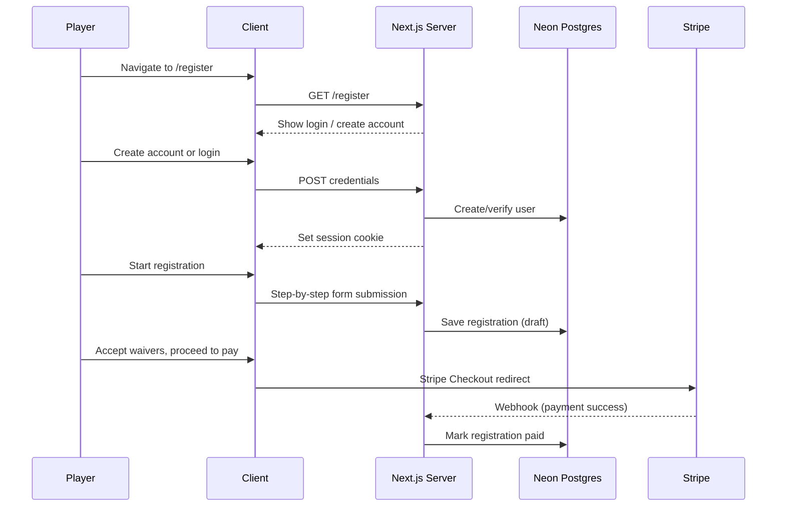
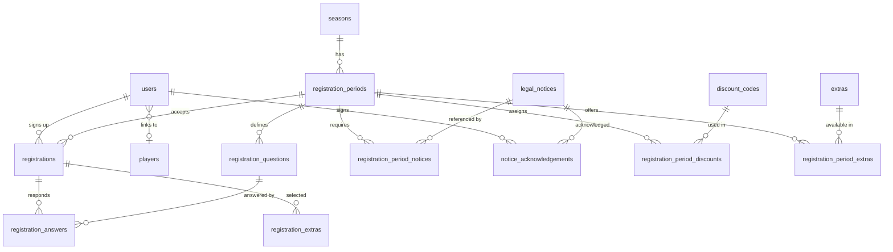

# PRD: User Registration & Payments

> **Status**: Draft
> **Author**: Chris Torres
> **Created**: 2026-04-27
> **Parent PRD**: [prd-admin-page.md](./prd-admin-page.md)

## 1. Overview

This module delivers the player self-service registration portal — account creation, season sign-up, digital waivers, and payment processing. This replaces manual Venmo tracking, paper waivers, and spreadsheet roster curation with an automated pipeline.

### What's in scope

- Player/user authentication (accounts, login, profile)
- Registration period configuration (admin) with "Import Previous Setup" cloning
- Multi-step registration funnel (player-facing, 13-step flow)
- Custom restrictions (age gating, rookie/returning status)
- Extras/add-ons (optional line items: donations, tournament fees)
- Discount codes (flat dollar off, expiration dates, max-use caps)
- Digital waiver/notice system with admin-managed library (Basic + Legal ack types)
- Payment integration via Stripe Checkout
- Rookie deferred payment flow (register now, pay after draft)
- Admin registration dashboard & finance overview
- "Copy Previous Registration" flow for returning players
- Customizable confirmation emails (per registration period)

### What's NOT in scope (deferred)

- **Coach Registration** — Sportability supports a coach registration type; BASH does not use it. Can be added as a future registration type enum value.
- **Team Registration** — Sportability supports team-level registration; BASH only uses individual player registration. Can be added as a future registration type enum value.
- **Captain team invite links** — Not present in legacy Sportability system; deferred until demand is clear.
- **Player ban list / holds** — Ability to permanently bar a player from future registrations. Flagged for future implementation.
- **Resources** — Sportability has a "Resources" section; purpose unclear and not used by BASH. Investigate if needed in a future phase.
- **Automated reminder emails** — No auto-emails for unpaid rookies. Admins monitor unpaid status via the dashboard.
- Refund management tools (use Stripe Dashboard directly)
- Full waitlist automation (P2)
- Payment plans / partial payments
- **Draft integration** (separate PRD) — The draft tool currently uses a Sportability CSV import as an interim bridge for registration data (see [prd-draft.md §5.1](./prd-draft.md)). Field names in the draft's `registration_meta` JSONB are intentionally aligned with the `registrations` table columns defined below (§2.3) so that migration requires only changing the data source. When this module is built, the draft pool import should read directly from `registrations` + `registrationAnswers` instead of CSV.
- In-app messaging between teams

---

## 2. Architecture

### 2.0 Design System

All player-facing and admin-facing UI uses **shadcn/ui** components (already in `components/ui/`) styled in the **Vercel design language** the rest of the site uses: oklch-based color tokens from `app/globals.css`, generous whitespace, dense but readable typography, monochrome with one accent color for primary actions. No bespoke component libraries, no Tailwind UI marketplace components, no animated gradients. Forms use shadcn's `Form`/`Input`/`Select`/`Checkbox`/`Label`/`Button` primitives. Modals use `Dialog`. Confirmations use `AlertDialog`. Tables use `Table`. Toasts via `sonner` (already wired). Icons from `lucide-react`.

The registration funnel is a multi-step form, not a wizard with chrome — minimal progress indicator, single primary action per step, back link in the corner. Match the visual density of `/admin/seasons/[id]` rather than something marketing-y.

### 2.1 Auth Strategy

The current admin system uses a PIN-based session cookie (`admin_session`). Player auth requires individual accounts. We'll use **NextAuth.js v5** (Auth.js) with the Drizzle adapter, supporting:

- **Email/password** — primary method for all players
- **Google OAuth** — optional convenience login
- **Magic link** — fallback for password-less access

Auth sessions are stored in the database via the Drizzle adapter, keeping everything in Neon Postgres.



**Coexistence with admin PIN auth**: The admin PIN system (`/admin/*`) remains unchanged. Player auth operates on separate routes (`/register`, `/account`, `/api/auth/*`). The admin layout continues to use its own `admin_session` cookie.

### 2.2 Layout & Routing

The canonical entry point is **`bash.fan/register`** — short, memorable, easy to put on flyers and in Slack. **Only one registration period is ever open at a time** (BASH runs sequentially: fall, then summer, etc.), so `/register` is just the funnel for whichever period is currently open. No picker, no period IDs in URLs that players see. The `[periodId]` route exists for confirmation links and historical deep links only.

If no period is currently open, `/register` shows a "Registration is closed — next season opens [date]" message with a link to `/account` for past registrations.

```
app/
  register/
    page.tsx                ← Funnel for the single currently-open period
    [periodId]/
      page.tsx              ← Funnel by explicit period (used by confirmation links)
      confirmation/
        page.tsx            ← Post-payment confirmation
  account/
    page.tsx                ← Player profile & registration history
    settings/
      page.tsx              ← Email, password, profile management
  api/
    auth/[...nextauth]/
      route.ts              ← NextAuth.js handler
    register/
      [periodId]/
        route.ts            ← Registration CRUD
        validate-discount/route.ts ← Validate discount code
      stripe/
        checkout/route.ts   ← Create Stripe Checkout session
        webhook/route.ts    ← Stripe webhook handler
      history/route.ts      ← Past registrations for copy flow
  admin/
    registration/
      page.tsx              ← Admin registration dashboard
      notices/
        page.tsx            ← Notice/waiver library CRUD
      extras/
        page.tsx            ← Extras/add-ons library CRUD
      discounts/
        page.tsx            ← Discount codes library CRUD
      periods/
        [periodId]/
          page.tsx          ← Period configuration wizard
```

### 2.3 Database Changes

All new tables. No modifications to existing tables — the `players` table is linked via a nullable FK from the new `users` table.

#### New Tables (Drizzle schema additions to `lib/db/schema.ts`)

```typescript
// ─── Auth (NextAuth Drizzle Adapter) ────────────────────────────────────────
// Tables: users, accounts, sessions, verification_tokens
// These follow the NextAuth Drizzle adapter spec exactly.

export const users = pgTable("users", {
  id: text("id").primaryKey(),                    // cuid or uuid
  name: text("name"),
  email: text("email").notNull().unique(),
  emailVerified: timestamp("email_verified", { withTimezone: true }),
  image: text("image"),
  passwordHash: text("password_hash"),            // bcrypt hash (null for OAuth-only)
  playerId: integer("player_id")                  // link to existing players table
    .references(() => players.id),
  createdAt: timestamp("created_at", { withTimezone: true }).defaultNow(),
})

// ─── Registration Periods ───────────────────────────────────────────────────

export const registrationPeriods = pgTable("registration_periods", {
  id: text("id").primaryKey(),                    // gen-[UUID]
  seasonId: text("season_id")
    .notNull()
    .references(() => seasons.id),
  status: text("status").notNull().default("draft"),  // draft | open | closed
  dateOpen: timestamp("date_open", { withTimezone: true }),
  dateClose: timestamp("date_close", { withTimezone: true }),
  baseFee: integer("base_fee").notNull().default(0),  // cents
  maxPlayers: integer("max_players"),                  // null = unlimited
  ageMinimum: integer("age_minimum"),
  ageAsOfDate: text("age_as_of_date"),                // ISO date string
  earlybirdDeadline: timestamp("earlybird_deadline", { withTimezone: true }),
  earlybirdDiscount: integer("earlybird_discount").default(0),   // cents
  lateFeeDate: timestamp("late_fee_date", { withTimezone: true }),
  lateFeeAmount: integer("late_fee_amount").default(0),          // cents
  requiresEmergencyInfo: boolean("requires_emergency_info").notNull().default(true),
  requiresJerseySize: boolean("requires_jersey_size").notNull().default(false),
  adminNotes: text("admin_notes"),
})

// ─── Custom Questions ───────────────────────────────────────────────────────

export const registrationQuestions = pgTable("registration_questions", {
  id: serial("id").primaryKey(),
  periodId: text("period_id")
    .notNull()
    .references(() => registrationPeriods.id, { onDelete: "cascade" }),
  questionText: text("question_text").notNull(),
  questionType: text("question_type").notNull().default("text"),  // text | select
  options: jsonb("options"),     // for select type: ["Yes", "No", "Maybe"]
  sortOrder: integer("sort_order").notNull().default(0),
  isRequired: boolean("is_required").notNull().default(false),
})

// ─── Legal Notices / Waivers ────────────────────────────────────────────────

export const legalNotices = pgTable("legal_notices", {
  id: serial("id").primaryKey(),
  title: text("title").notNull(),
  body: text("body").notNull(),           // rich text / markdown
  ackType: text("ack_type").notNull().default("basic"),
    // basic = "I have read this notice" checkbox
    // legal = "I have read and agree to be legally bound" checkbox
  version: integer("version").notNull().default(1),
  createdAt: timestamp("created_at", { withTimezone: true }).defaultNow(),
  updatedAt: timestamp("updated_at", { withTimezone: true }).defaultNow(),
})

export const registrationPeriodNotices = pgTable(
  "registration_period_notices",
  {
    periodId: text("period_id")
      .notNull()
      .references(() => registrationPeriods.id, { onDelete: "cascade" }),
    noticeId: integer("notice_id")
      .notNull()
      .references(() => legalNotices.id),
    sortOrder: integer("sort_order").notNull().default(0),
  },
  (t) => [primaryKey({ columns: [t.periodId, t.noticeId] })]
)

// ─── Registrations ──────────────────────────────────────────────────────────

export const registrations = pgTable(
  "registrations",
  {
    id: text("id").primaryKey(),                    // gen-[UUID]
    userId: text("user_id")
      .notNull()
      .references(() => users.id),
    periodId: text("period_id")
      .notNull()
      .references(() => registrationPeriods.id),
    status: text("status").notNull().default("draft"),
      // draft | pending_payment | registered_unpaid | paid | cancelled | waitlisted
    registrationType: text("registration_type").notNull().default("individual"),
      // individual (only type for MVP; coach | team reserved for future)
    teamSlug: text("team_slug")
      .references(() => teams.slug),               // null for free agents

    // ─── Contact snapshot ───────────────────────────────────────────────
    phone: text("phone"),
    address: text("address"),

    // ─── Personal ───────────────────────────────────────────────────────
    birthdate: text("birthdate"),
    gender: text("gender"),
    tshirtSize: text("tshirt_size"),       // Adult S/M/L/XL/XXL
    // NOTE: rookie status is NOT stored here — it's derived from
    // prior `paid` registrations + prior fall `player_seasons` rows.
    // See §3.9. Single source of truth, no drift risk.

    // ─── Emergency / Medical ────────────────────────────────────────────
    emergencyName: text("emergency_name"),
    emergencyPhone: text("emergency_phone"),
    healthPlan: text("health_plan"),
    healthPlanId: text("health_plan_id"),
    doctorName: text("doctor_name"),
    doctorPhone: text("doctor_phone"),
    medicalNotes: text("medical_notes"),

    // ─── Experience ─────────────────────────────────────────────────────
    yearsPlayed: integer("years_played"),
    skillLevel: text("skill_level"),        // advanced | intermediate | beginner
    positions: text("positions"),            // free text (e.g. "D", "C/RW")
    lastLeague: text("last_league"),         // free text
    lastTeam: text("last_team"),             // free text
    miscNotes: text("misc_notes"),           // "Please include special/misc info"

    // ─── Payment ────────────────────────────────────────────────────────
    amountPaid: integer("amount_paid"),              // cents
    stripeSessionId: text("stripe_session_id"),
    paidAt: timestamp("paid_at", { withTimezone: true }),
    manualPayment: boolean("manual_payment").notNull().default(false),

    createdAt: timestamp("created_at", { withTimezone: true }).defaultNow(),
    updatedAt: timestamp("updated_at", { withTimezone: true }).defaultNow(),
  },
  (t) => [
    index("idx_registrations_user").on(t.userId),
    index("idx_registrations_period").on(t.periodId),
  ]
)

// ─── Custom Answers ─────────────────────────────────────────────────────────

export const registrationAnswers = pgTable(
  "registration_answers",
  {
    registrationId: text("registration_id")
      .notNull()
      .references(() => registrations.id, { onDelete: "cascade" }),
    questionId: integer("question_id")
      .notNull()
      .references(() => registrationQuestions.id),
    answer: text("answer"),
  },
  (t) => [primaryKey({ columns: [t.registrationId, t.questionId] })]
)

// ─── Waiver Acknowledgements ────────────────────────────────────────────────

export const noticeAcknowledgements = pgTable(
  "notice_acknowledgements",
  {
    id: serial("id").primaryKey(),
    userId: text("user_id")
      .notNull()
      .references(() => users.id),
    noticeId: integer("notice_id")
      .notNull()
      .references(() => legalNotices.id),
    registrationId: text("registration_id")
      .references(() => registrations.id),
    acknowledgedAt: timestamp("acknowledged_at", { withTimezone: true }).defaultNow(),
  },
  (t) => [
    index("idx_notice_ack_user").on(t.userId),
  ]
)

// ─── Discount Codes ─────────────────────────────────────────────────────────

export const discountCodes = pgTable("discount_codes", {
  id: serial("id").primaryKey(),
  code: text("code").notNull().unique(),
  reason: text("reason"),                          // admin description
  amountOff: integer("amount_off").notNull(),       // cents (flat dollar only)
  limitation: text("limitation").notNull().default("unlimited"),
    // unlimited | once_per_family | once_per_registrant
  maxUses: integer("max_uses"),                    // null = unlimited total
  usedCount: integer("used_count").notNull().default(0),
  expiresAt: timestamp("expires_at", { withTimezone: true }), // null = no expiry
  active: boolean("active").notNull().default(true),
})

// ─── Discount Code ↔ Period Assignment ──────────────────────────────────────
// Discount codes are a global library; assigned to specific periods via join.

export const registrationPeriodDiscounts = pgTable(
  "registration_period_discounts",
  {
    periodId: text("period_id")
      .notNull()
      .references(() => registrationPeriods.id, { onDelete: "cascade" }),
    discountId: integer("discount_id")
      .notNull()
      .references(() => discountCodes.id),
  },
  (t) => [primaryKey({ columns: [t.periodId, t.discountId] })]
)

// ─── Extras / Add-Ons ───────────────────────────────────────────────────────

export const extras = pgTable("extras", {
  id: serial("id").primaryKey(),
  name: text("name").notNull(),                   // e.g. "BASH Donation"
  description: text("description"),
  price: integer("price").notNull().default(0),    // cents (0 = free add-on)
  detailType: text("detail_type"),                 // null | text | size_dropdown
    // null = checkbox only, text = collects text input, size_dropdown = S/M/L/XL/XXL
  detailLabel: text("detail_label"),               // e.g. "Please enter amount"
  active: boolean("active").notNull().default(true),
})

export const registrationPeriodExtras = pgTable(
  "registration_period_extras",
  {
    periodId: text("period_id")
      .notNull()
      .references(() => registrationPeriods.id, { onDelete: "cascade" }),
    extraId: integer("extra_id")
      .notNull()
      .references(() => extras.id),
    sortOrder: integer("sort_order").notNull().default(0),
  },
  (t) => [primaryKey({ columns: [t.periodId, t.extraId] })]
)

export const registrationExtras = pgTable(
  "registration_extras",
  {
    registrationId: text("registration_id")
      .notNull()
      .references(() => registrations.id, { onDelete: "cascade" }),
    extraId: integer("extra_id")
      .notNull()
      .references(() => extras.id),
    detail: text("detail"),                        // text answer or size selection
  },
  (t) => [primaryKey({ columns: [t.registrationId, t.extraId] })]
)
```

> [!IMPORTANT]
> All monetary values are stored in **cents** (integer) to avoid floating point issues. Display logic divides by 100.

> [!NOTE]
> The Neon HTTP driver constraint applies — no `db.transaction()`. Multi-step writes use sequential `await db.*` calls, consistent with the rest of the codebase.

#### ER Diagram (new tables only)



---

## 3. Features

### 3.1 User Accounts & Auth

**Dependencies**: `next-auth@5`, `@auth/drizzle-adapter`, `bcryptjs`

- Email/password registration with email verification
- Google OAuth (optional convenience login)
- Magic link login (fallback for password-less access)
- Profile page at `/account` showing name, email, linked player record, and registration history
- **Player linking**: On first registration, the system attempts to match the user's name against the existing `players` table. If a match is found, `users.playerId` is set. Admins can also manually link/unlink from the admin dashboard.

### 3.2 Registration Period Setup (Admin)

Accessible at `/admin/registration/periods/[periodId]`. Integrated into the existing season detail page as the **Registration tab**.

**Configuration fields**:

| Field | Type | Description |
|---|---|---|
| Date Open | datetime | When registration opens to players |
| Date Close | datetime | When registration closes |
| Base Fee | currency | Season fee in dollars (stored as cents); BASH uses flat fee ($150) |
| Max Players | number | Hard cap; null = unlimited |
| Age Minimum | number | Minimum age to register (e.g. 18) |
| Age As-Of Date | date | Date to calculate age against (e.g. 10/1/2026) |
| Custom Restriction | toggle + text | Rookie/returning gating with configurable warning text |
| Requires Emergency Info | toggle | Show emergency/medical fields |
| T-Shirt Size Collection | toggle | Show t-shirt size field |
| Confirmation Email Body | rich text | Custom email sent after payment (see §3.8) |

> [!NOTE]
> **Earlybird/Late Fee**: Sportability supports earlybird discounts and late fees as date-driven surcharges. BASH currently uses flat fees only. The `registrationPeriods` schema retains `earlybirdDeadline`, `earlybirdDiscount`, `lateFeeDate`, and `lateFeeAmount` columns for future use but they are not exposed in the MVP admin UI.

**Import Previous Setup**: Select a past season's period and clone its full configuration (fee, restrictions, custom questions, notice assignments, extras, discounts). "Bump Year" option shifts all dates forward by exactly 1 year. This mirrors Sportability's "Import Reg Setup" feature which was the primary workflow for season-over-season configuration.

**Individual Setup** (per-period configuration imported or manually set):

| Section | Fields | Notes |
|---|---|---|
| Contact Info | Name, Address, Phone, Email | Always collected |
| General Notes | Up to 3 custom questions (64-char limit) | Displayed inline on contact info step |
| Misc Notes | Free-text area | "Please include special/misc information" |
| Personal Data | DOB, Gender | DOB pre-filled from gating; read-only |
| T-Shirt Size | Dropdown (Adult S–XXL) | Toggled on/off per period |
| Emergency/Medical | Health Plan, Doctor Name/Phone, Medical Notes | Toggled on/off per period |
| Experience | Years Played, Skill Level, Position(s), Last League, Last Team | Skill level: Beginner/Intermediate/Advanced |

### 3.3 Registration Funnel (Player-Facing)

Multi-step wizard at `/register` (or `/register/[periodId]` for deep links). Progress is auto-saved to the `registrations` table as `status: "draft"` so players can resume later.

The funnel branches at the very first decision: **do we recognize you?** Returning players don't re-enter information we already have; new players get the full intake form.

#### Returning player flow (5 steps)

If the player logs in and we have at least one prior paid registration linked to their account, autofill happens immediately — before any form step.

| Step | Name | Description |
|---|---|---|
| 1 | **Login** | Email + password / Google / magic link. We identify the player and surface their prior registrations. |
| 2 | **Pick prior registration to copy** | If they have multiple, show a one-screen picker (last team, season, summary). Auto-skipped if there's only one. |
| 3 | **Confirm & update** | Single consolidated screen with every field pre-filled (contact, personal, emergency, experience). Player edits anything that changed. Custom questions for *this* period are required. |
| 4 | **Sign waivers** | Notices + legal waivers for this period. Always required (versions are tracked, ack rows are per-registration). |
| 5 | **Review → Pay** | Cost summary (base + extras − discount), discount code entry, → Stripe Checkout. |

A returning player whose data hasn't changed can finish in under a minute.

#### New player flow (full intake)

For players with no claimable prior registration. Birthdate and rookie status are collected here; rookie status is *also* derived from `registrations` history once they're linked, so the form value is just a hint to the funnel for gating.

| Step | Name | Description |
|---|---|---|
| 1 | **Gating** | Age check (birthdate) + custom restriction (e.g. "Are you a BASH rookie?"). Blocks ineligible players. |
| 2 | **Account** | Create account (email/password, Google, or magic link). |
| 3 | **Contact info** | Name, address, phone, email. Custom questions for this period. Misc notes. |
| 4 | **Personal** | Gender, t-shirt size (if collected for this period). Birthdate carried from gating. |
| 5 | **Emergency & Medical** | Health plan, doctor, medical notes. Shown only if `requiresEmergencyInfo`. |
| 6 | **Experience** | Years played, skill level, position(s), last league, last team. |
| 7 | **Sign waivers** | Notices + legal waivers. |
| 8 | **Review → Pay** | Cost summary, discount entry, → Stripe Checkout. |

> [!IMPORTANT]
> **Rookies**: Players who self-identify as rookies (new flow Step 1) follow a deferred payment flow. They complete all form steps but use a special discount code to skip payment. After the draft, admins send payment reminders. Registration status: `registered_unpaid` until payment is completed. See §3.9.

#### Why this ordering

The original 13-step Sportability flow asked for gating data, then login, then waivers, then *finally* offered to copy prior data — by which point the player had already entered information we already had. Putting login first for the returning case lets us short-circuit gating entirely (we know their birthdate, we know if they're a rookie from prior registrations) and reduce the visible form to "confirm what we have, sign, pay."

### 3.4 Digital Waivers & Notices

**Notice Library** (admin-managed at `/admin/registration/notices`):

- CRUD interface for reusable notices (global library, not per-season)
- Fields: Title, Body (markdown/rich text), Acknowledgement Type
- **Ack Types**:
  - `basic` — Player sees: "I have read this notice" checkbox *(e.g. Free Agency notice)*
  - `legal` — Player sees: "I have read the above notice, and agree to be legally bound by it" checkbox *(e.g. BASH Participation Waiver)*

**Assignment**: When configuring a registration period, admins select notices from the library and set display order. Each notice is assigned with a "Show To" scope (currently only `individuals` for BASH; `teams` and `coaches` reserved for future registration types).

**Version tracking**: Notices have a `version` field incremented on body edits. `notice_acknowledgements` records which version was signed. Previous versions are preserved for audit trail.

**Agreement stats**: Track current agreements (this period) and total agreements (all time) per notice.

**BASH's active notices**:
- **BASH Participation Waiver** (Legal) — Full liability release referencing The Lick + Dolores Park
- **Free Agency** (Basic) — Instructions for declaring free agency with deadline

### 3.5 Payment Integration

**Provider**: Stripe Checkout (hosted payment page — no PCI scope on our server). This replaces Sportability's legacy raw credit card form.

**Flow**:
1. Player completes registration funnel → clicks "Complete Payment"
2. Server creates a Stripe Checkout Session with the calculated fee
3. Player is redirected to Stripe's hosted page (supports Apple Pay, Google Pay, all major cards)
4. On success, Stripe sends a webhook to `/api/register/stripe/webhook`
5. Webhook handler updates `registrations.status` → `paid`, sets `paidAt` and `stripeSessionId`
6. Confirmation email sent to player (see §3.8)

**Fee calculation** (server-side):
```
finalFee = baseFee
if (now < earlybirdDeadline) finalFee -= earlybirdDiscount  // future use
if (now > lateFeeDate)       finalFee += lateFeeAmount       // future use
for (extra in selectedExtras) finalFee += extra.price
if (discountCode)            finalFee -= discountCode.amountOff
finalFee = max(finalFee, 0)
```

**Manual/cash payments**: Admins can mark a registration as "Paid (Manual)" from the admin dashboard, setting `manualPayment = true` without a Stripe session.

### 3.6 Extras / Add-Ons

Optional line items offered during registration. Global library assigned per period.

**BASH examples**:
- **BASH Donation** — Price: $0, Detail Type: `text`, Detail Label: "Amount" *(player enters custom donation amount)*
- **BASH Tournament** — Price: fixed, Detail Type: `size_dropdown` *(collects t-shirt size for tournament jersey)*

**Admin workflow**:
1. Create extras in global library (`/admin/registration/extras`)
2. Assign specific extras to registration periods (from period config page, "Assign Extras")
3. Player sees assigned extras as optional checkboxes during registration Step 11

**Detail collection types**:
| Type | Player sees | Use case |
|---|---|---|
| `null` | Checkbox only | Simple opt-in |
| `text` | Checkbox + text input | Custom amount, notes |
| `size_dropdown` | Checkbox + S/M/L/XL/XXL dropdown | Jersey/shirt sizing |

### 3.7 Discount Codes

Flat-dollar discount codes managed as a global library, assigned per period.

**Data model**:
| Field | Type | Description |
|---|---|---|
| Code | text | Short alphanumeric string (e.g. "k10", "xrook", "Capt6") |
| Amount Off | currency | Flat dollar amount (e.g. $10, $25, $150) |
| Reason | text | Admin description (e.g. "Summer discount", "Late rookies (after third pickup)") |
| Limitation | enum | `unlimited` / `once_per_family` / `once_per_registrant` |
| Max Uses | number | Total redemption cap; null = unlimited |
| Expires At | datetime | Code stops working after this date; null = no expiry |

**Player-facing**: Discount code entry appears on the Cost step (Step 12). Code is validated server-side: checks active status, expiration, max uses, and limitation constraints. Applied discount reduces the displayed total.

**Admin workflow**:
1. Create codes in global library (`/admin/registration/discounts`)
2. Assign specific codes to registration periods
3. Monitor usage from admin dashboard

### 3.8 Confirmation Email

Admin-configurable email sent to the player after successful payment. Configured per registration period.

- Supports custom body text (rich text / markdown)
- Auto-includes: player name, season name, registration date, amount paid
- Sent via transactional email provider (e.g. Resend, Postmark)

### 3.9 Rookie Deferred Payment Flow

BASH rookies are not guaranteed a roster spot until the draft. Their registration flow diverges:

1. Rookie status is **derived**, not stored: a player is a rookie iff they have no prior `paid` registration (or no prior fall-season `player_seasons` row, when player record claiming has happened). This mirrors the inference pattern used in `app/admin/seasons/[id]/page.tsx` for roster display — single source of truth, no drift.
2. **New player flow**: gating step asks "Are you a BASH rookie?" so the funnel can show appropriate copy and warnings; the answer is *not* persisted as a registration column.
3. **Returning player flow**: rookie status is determined automatically from the user's prior registration history — no question asked.
4. Player completes all form steps normally (data is still collected).
5. On the Review/Pay step, rookies see instructions to enter a specific discount code (e.g. "xrook" for $25 deferral or full comp code) that bypasses Stripe.
6. Registration saved with `status: "registered_unpaid"`.
7. After draft, admin sends payment reminder.
8. Player returns to complete payment via Stripe Checkout.
9. Status transitions to `paid`.

### 3.10 Admin Registration Dashboard

Located at `/admin/registration`. Provides both high-level visibility and detailed data access.

#### Summary View (Period List)

Shows all registration periods grouped by status:

| Group | Description |
|---|---|
| **Open** | Periods where `dateOpen < now < dateClose` |
| **Upcoming** | Periods where `now < dateOpen` |
| **Closed** | Periods where `now > dateClose` |

Each period card shows at-a-glance KPIs:

| Metric | Description |
|---|---|
| **Registered** | Total registrations (paid + unpaid) vs. max capacity |
| **Paid** | Count and total revenue collected |
| **Unpaid** | Count of `registered_unpaid` (primarily rookies) |
| **Rookies** | Count of self-identified rookies |
| **Waitlisted** | Count on waitlist (if cap reached) |
| **Discount Usage** | Total discount codes redeemed and value |

#### Registrant List (Period Drill-Down)

Clicking into a period shows the full registrant table with columns:

| Column | Description |
|---|---|
| Player Name | First + Last, linked to player record if matched |
| Rookie | Badge indicator |
| Payment Status | `paid` / `registered_unpaid` / `pending_payment` / `waitlisted` |
| Amount Paid | Dollar amount (or "—" if unpaid) |
| Discount Code | Code used, if any |
| Date Registered | When registration was submitted |
| Experience | Years + Skill Level (for draft planning) |
| Position(s) | Free text |
| Last Team | For returning player context |

**Admin actions on this view**:
- Mark manual payment (cash/Venmo)
- Cancel registration
- Move to/from waitlist
- Send payment reminder (for unpaid rookies)

#### Full Data Export (CSV)

"Export All" button generates a CSV matching the data fields BASH commissioners have historically received from Sportability's "Players-Extended" export. This is critical for draft planning, roster balancing, and commissioner workflows.

**Export columns** (mapped from Sportability's 86-column format, excluding unused fields):

| Group | Columns |
|---|---|
| **Identity** | League, Team, FirstName, LastName, Email, Phone |
| **Demographics** | Gender, Birthdate, Age, Address, City, State, Zip |
| **Status** | Captain, Rookie, CustomRestr (rookie/returning answer) |
| **Custom Questions** | CustomQ1, CustomQ2, CustomQ3 (admin-configured per period) |
| **Preferences** | Team Req, Buddy Req, Conflict, Notes (misc notes) |
| **Sizing** | TShirt, Jersey |
| **Experience** | ExpYrs, ExpSkill, ExpPos, ExpLeague, ExpTeam |
| **Medical** | HealthPlan, Doc Name, Doc Phone, MedNotes |
| **Payment** | PdDate, PdStatus, PdAmt, Discount Code 1 |
| **Extras** | Extras (comma-separated list of selected add-ons) |
| **Metadata** | DateAdded, HowAdded |

> [!NOTE]
> Sportability's export includes Parent/Guardian columns (Parent1_*, Parent2_*), School, Grade, Height, Weight — all youth-specific fields that are out of scope for BASH. These columns are omitted from our export.

### 3.11 Public Registration Hub

When active registration periods exist, the consumer portal displays an **"Upcoming Seasons"** section on the home page with:

- Season name and registration dates
- "Register Now →" link to `/register/[periodId]`
- Registration count / capacity (if max set)

### 3.12 Player Linking & Record Creation

Critical for platform migration: every player creates a new user account, but most already exist in the `players` table from 30+ years of historical data.

**Returning players** (during registration or account setup):

1. After entering their name, the system performs a fuzzy search against the existing `players` table
2. UI shows candidate matches with disambiguating info (seasons played, last team, position)
3. Player selects "This is me" to claim a record → sets `users.playerId`
4. If no match, player can proceed without linking (treated as new)
5. Admins can also manually link/unlink from the admin dashboard as a fallback

**Fuzzy matching strategy**: Reuse the existing `merge-duplicates.ts` name normalization logic (lowercase, strip suffixes, handle nicknames). Show matches scoring above a confidence threshold.

**New rookies**:
- A new `players` row is auto-created when registration reaches `paid` status
- `users.playerId` is set to the new player record
- The player then appears in roster/draft tools but not in stats until games are played

**Guest checkout** (no account):
- Instead of storing with `userId: null` (which breaks uniqueness constraints and payment tracking), guest checkout auto-creates a **lightweight user record** from the guest's email — no password set, `passwordHash: null`
- This preserves per-user tracking, the `(userId, periodId)` uniqueness constraint, and payment history
- If the guest later wants to log in, they use "Forgot Password" or magic link to activate their account
- Player linking is deferred until account activation

### 3.13 Draft Tool Field Alignment

> [!IMPORTANT]
> The draft tool ([prd-draft.md §5.1](./prd-draft.md)) currently uses a Sportability CSV import as an interim bridge, storing registration data as a `registration_meta` JSONB column on `draft_pool`. **Field names are intentionally aligned** with the `registrations` table columns defined in §2.3 above to ensure a smooth migration.

When this registration module is built, the migration path is:
1. The draft pool import stops reading from CSV
2. Instead it reads from `registrations` + `registrationAnswers` for the current season's period
3. The player card UI in the draft board requires **no changes** because the field names already match

**Pre-aligned fields** (draft `registration_meta` key → `registrations` column):

| Draft `registration_meta` | `registrations` Column | Notes |
|---|---|---|
| `skillLevel` | `skill_level` | Direct match |
| `positions` | `positions` | Direct match |
| `yearsPlayed` | `years_played` | Direct match |
| `lastLeague` | `last_league` | Direct match |
| `lastTeam` | `last_team` | Direct match |
| `birthdate` | `birthdate` | Direct match |
| `gender` | `gender` | Direct match |
| `tshirtSize` | `tshirt_size` | Direct match |
| `miscNotes` | `misc_notes` | Direct match |
| `gamesExpected` | `registrationAnswers` (Q1) | Becomes a dynamic custom question |
| `goalieWilling` | `registrationAnswers` (Q2) | Becomes a dynamic custom question |
| `playoffAvail` | `registrationAnswers` (Q3) | Becomes a dynamic custom question |
| `buddyReq` | — (new column or custom question) | Not yet in registration schema; add when needed |

---

## 4. API Routes

All registration API routes require authenticated user sessions (NextAuth). Admin routes additionally validate the `admin_session` cookie.

| Method | Route | Auth | Description |
|---|---|---|---|
| `GET/POST` | `/api/auth/[...nextauth]` | Public | NextAuth.js handler |
| `GET` | `/api/register/periods` | Public | List open registration periods |
| `GET` | `/api/register/[periodId]` | User | Get period config + user's draft registration |
| `POST` | `/api/register/[periodId]` | User | Create/update registration (draft) |
| `POST` | `/api/register/[periodId]/submit` | User | Finalize registration, validate, calculate fee |
| `POST` | `/api/register/stripe/checkout` | User | Create Stripe Checkout session |
| `POST` | `/api/register/stripe/webhook` | Stripe | Handle payment events |
| `GET` | `/api/register/history` | User | User's past registrations (for copy flow) |
| `POST` | `/api/register/[periodId]/validate-discount` | User | Validate discount code |
| `GET` | `/api/admin/registration/periods` | Admin | List all periods with stats |
| `POST` | `/api/admin/registration/periods` | Admin | Create registration period |
| `PUT` | `/api/admin/registration/periods/[id]` | Admin | Update period configuration |
| `POST` | `/api/admin/registration/periods/[id]/import` | Admin | Import config from previous period |
| `GET` | `/api/admin/registration/periods/[id]/registrants` | Admin | List registrants for a period |
| `GET` | `/api/admin/registration/periods/[id]/export` | Admin | Full CSV export (Players-Extended format) |
| `PUT` | `/api/admin/registration/[regId]/status` | Admin | Mark paid/cancel |
| `GET` | `/api/admin/registration/notices` | Admin | List notice library |
| `POST` | `/api/admin/registration/notices` | Admin | Create notice |
| `PUT` | `/api/admin/registration/notices/[id]` | Admin | Update notice (increments version) |
| `DELETE` | `/api/admin/registration/notices/[id]` | Admin | Delete notice |
| `GET` | `/api/admin/registration/extras` | Admin | List extras library |
| `POST` | `/api/admin/registration/extras` | Admin | Create extra |
| `PUT` | `/api/admin/registration/extras/[id]` | Admin | Update extra |
| `DELETE` | `/api/admin/registration/extras/[id]` | Admin | Delete extra |
| `GET` | `/api/admin/registration/discounts` | Admin | List discount codes |
| `POST` | `/api/admin/registration/discounts` | Admin | Create discount code |
| `PUT` | `/api/admin/registration/discounts/[id]` | Admin | Update discount code |
| `DELETE` | `/api/admin/registration/discounts/[id]` | Admin | Delete discount code |

---

## 5. Public Site Impact

### New public-facing pages
- `/register` — Registration landing page (lists open periods)
- `/register/[periodId]` — Multi-step registration funnel
- `/account` — Player profile and registration history

### Existing page changes
- **Home page**: Add "Upcoming Seasons / Register Now" banner when open periods exist
- **Navigation**: Add "Register" link to `SiteHeader` when active periods exist
- **Season detail** (admin): Replace Registration tab placeholder with live registration management

### Backwards compatibility
- All existing public pages and APIs remain unchanged
- The `players` table is not modified — the new `users` table has an optional FK to it
- Existing admin PIN auth is unaffected

---

## 6. Edge Cases & Constraints

| Scenario | Handling |
|---|---|
| **Account merging** | If a user creates two accounts, admins can manually reassign `users.playerId`. Self-service merge is out of scope. |
| **Offline/cash payments** | Admin marks registration as "Paid (Manual)" — no Stripe session created. |
| **Registration cap reached** | New registrations get `status: "waitlisted"`. Admins can manually promote from waitlist. |
| **Stripe webhook failure** | Implement webhook retry handling with idempotency keys. Registration stays `pending_payment` until confirmed. |
| **Mid-funnel abandonment** | Registration saved as `draft`. Player can resume from `/account`. |
| **Age restriction** | Calculated server-side using `birthdate` and `ageAsOfDate`. Blocked with clear error if under minimum. |
| **Rookie self-identification** | Returning players who answer "Yes" to rookie question lose returning status. Warning displayed prominently. |
| **Expired discount code** | Validated server-side. Returns clear error if code is expired, maxed out, or not assigned to this period. |
| **$0 total after discounts** | Skip Stripe Checkout entirely. Mark registration as `paid` with `amountPaid = 0`. |
| **Duplicate registration** | Enforce unique constraint on `(userId, periodId)`. Player can only register once per period. |

---

## 7. Security

- **PCI Compliance**: No credit card data touches our server. Stripe Checkout is a hosted redirect.
- **Stripe Webhook Verification**: All webhook events verified via `stripe.webhooks.constructEvent()` with the signing secret.
- **Medical Data**: Emergency/medical fields are stored in the main `registrations` table (not a separate table) for simplicity. Access is restricted to admin routes only — player-facing APIs never return other users' medical data.
- **CSRF**: NextAuth.js handles CSRF tokens for auth routes. Registration form submissions use standard Next.js server actions or API routes with session validation.

---

## 8. Open Questions

- [x] ~~Resources feature~~ **Resolved**: Moved to out-of-scope.
- [x] ~~Rookie reminder emails~~ **Resolved**: No automated emails. Dashboard shows unpaid rookies prominently after registration close.
- [x] ~~Guest checkout~~ **Resolved**: Yes, supported. Rather than `userId: null` (which breaks uniqueness/tracking), guest checkout auto-creates a lightweight user record from the guest's email with no password. See §3.12.
- [x] ~~Player record auto-creation~~ **Resolved**: Returning players see a fuzzy name match UI to claim their existing `players` record. Rookies get a new `players` entry auto-created upon paid registration. See §3.12.
- [ ] **Transactional email provider**: Selection needed for confirmation emails. Comparison below:

#### Email Provider Comparison

| | **Resend** | **Postmark** | **SendGrid** |
|---|---|---|---|
| **Free Tier** | 3,000 emails/mo (100/day cap) | 100 emails/mo | ❌ 60-day trial only |
| **Paid Start** | $20/mo (50K emails) | $15/mo (10K emails) | $19.95/mo (50K emails) |
| **DX** | Modern API, React Email templates, excellent docs | Clean API, great deliverability reputation | Mature but heavier SDK, more enterprise-focused |
| **Next.js Integration** | First-class (`@react-email` ecosystem) | Good (simple HTTP API) | Good (official Node SDK) |
| **Deliverability** | Good | Excellent (industry-leading) | Good |
| **BASH Volume** | ~150 confirmation emails/season — free tier is more than sufficient | Free tier is tight (100/mo) — may need paid | No permanent free tier |
| **Recommendation** | ✅ **Best fit** — generous free tier covers BASH volume, modern DX | Good but free tier too small | Overkill and no free tier |

---

## 9. Implementation Phases

### Phase A — Foundation (recommended first PR)
- NextAuth.js integration + user accounts
- Database schema migration (all new tables including extras, discounts)
- Basic `/account` page
- Admin notice library CRUD
- Admin extras library CRUD
- Admin discount codes library CRUD

### Phase B — Registration Config & Funnel
- Registration period admin configuration
- Import Previous Setup with Bump Year
- Custom restrictions (age gating only — rookie status is derived)
- **Returning player flow** (5 steps): login → pick prior → confirm/update → sign waivers → pay
- **New player flow** (full intake): gating → account → contact → personal → emergency → experience → waivers → pay
- Custom questions
- Extras selection
- Discount code validation
- All steps built on shadcn/ui per §2.0

### Phase C — Payments & Launch
- Stripe Checkout integration
- Webhook handling
- Fee calculation (base + extras - discounts)
- Rookie deferred payment flow
- Confirmation email system
- Admin registration dashboard (registrant list, manual payment, CSV export)
- Public registration hub on home page
